# Computer Organization and Operating System Lab #11

# Section 0: Introduction

<p align="center">
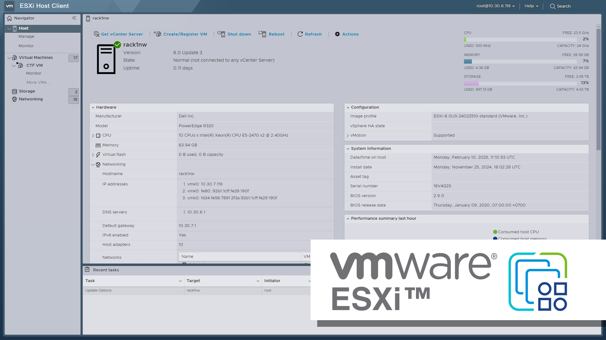
</p>

### **VMware ESXi คืออะไร**

- **Type-1 Hypervisor (Bare-Metal Hypervisor):** ESXi เป็นซอฟต์แวร์ที่ติดตั้งและทำงานบนฮาร์ดแวร์โดยตรง (directly on the physical server hardware) ไม่ต้องมีระบบปฏิบัติการหลัก (host OS) เหมือน Type-2 Hypervisor (เช่น VMware Workstation) ทำให้มีประสิทธิภาพสูงและใช้ทรัพยากรน้อยกว่า
- **Virtualization Platform:** ESXi ทำหน้าที่สร้างและจัดการ Virtual Machines (VMs) หลาย ๆ ตัวบนเซิร์ฟเวอร์กายภาพเครื่องเดียว ทำให้สามารถรันระบบปฏิบัติการและแอปพลิเคชันที่แตกต่างกันบนฮาร์ดแวร์เดียวกันได้อย่างอิสระ

### **ฟีเจอร์หลัก (Key Features)**

1. **Resource Abstraction & Sharing:** ESXi จะ "abstract" ทรัพยากรฮาร์ดแวร์ (CPU, memory, storage, network) และแบ่งสรรให้แต่ละ VM ใช้งานได้อย่างมีประสิทธิภาพ
2. **Isolation:** แต่ละ VM ทำงานแยกจากกันอย่างสมบูรณ์ (isolated environment) หาก VM หนึ่งมีปัญหา จะไม่กระทบ VM อื่น ๆ
3. **Centralized Management (vCenter Server):** แม้ ESXi จะทำงานได้ด้วยตัวเอง แต่โดยทั่วไปจะใช้ร่วมกับ vCenter Server เพื่อให้สามารถบริหารจัดการ ESXi hosts และ VMs หลาย ๆ ตัวได้จากศูนย์กลาง (centralized management)
<p align="center">
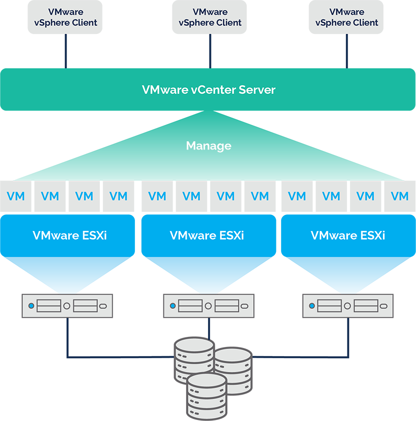
</p>

4. **High Availability & Fault Tolerance (with vCenter):** สามารถทำ High Availability (HA) เพื่อให้ VM ย้ายไปทำงานบน host อื่นได้อัตโนมัติเมื่อ host หลักมีปัญหา และ Fault Tolerance (FT) เพื่อให้ VM มีสำเนาทำงานพร้อมกันบน host อื่นตลอดเวลา
5. **vMotion (with vCenter):** ย้าย VM ที่กำลังทำงานอยู่ (live migration) จาก ESXi host หนึ่งไปยังอีก host หนึ่งได้โดยไม่มี downtime (zero downtime)
<p align="center">
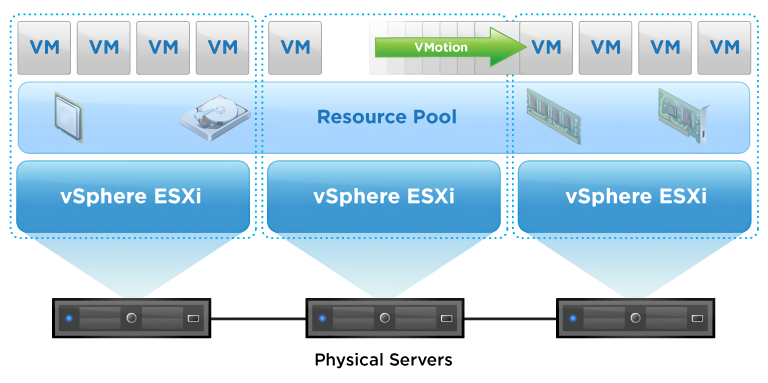
</p>

# Section 1: Preparation

<!-- > [!WARNING]
>⚠️<ins>**หมายเหตุ**</ins> ESXi ไม่รองรับสถาปัตยกรรม ARM ดังนั้น Apple Silicon ไม่สามารถใช้งานได้ -->

## Prerequisite - ข้อกำหนดเบื้องต้น
- ต้องมี VMware Workstation ติดตั้งอยู่บนเครื่อง หากไม่มีให้ Download และติดตั้งจากที่นี่
    - [&nbsp;&nbsp;Workstation Pro 17.6.1 for Windows](https://fs-bucket.jarukrit.net/Bootcamp/VMware-workstation-full-17.6.1-24319023.exe)
    - [&nbsp;&nbsp;Workstation Pro 17.6.1 for Linux](https://fs-bucket.jarukrit.net/Bootcamp/VMware-Workstation-Full-17.6.1-24319023.x86_64.bundle)
    - [&nbsp;&nbsp;Fusion Pro 13.6.1 for macOS](https://fs-bucket.jarukrit.net/Bootcamp/VMware-Fusion-13.6.1-24319021_universal.dmg)
    - **ตอนเปิดใช้งานครั้งแรกอย่าลืมเลือก**<br/>✅ Use VMware Workstation 17 for Personal Use สำหรับ Windows/Linux<br/>✅ I want to license VMware Fusion 13 Pro for Personal use. สำหรับ macOS
- ตรวจสอบว่าสามารถใช้งาน Nested Virtualization ด้วยการเปิด &nbsp;`msinfo32` จากสามารถเปิด โดยการค้นหาจาก Start Menu<br/>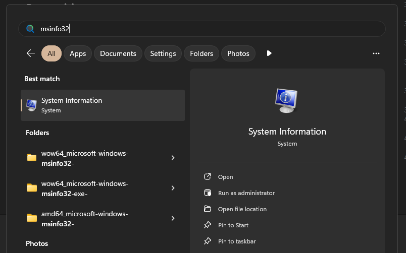<br/>จากนั้นตรวจสอบว่า Virtualization-based security เป็น `Not enabled` หรือไม่
<br/><br/>หากพบว่ายังเป็น `Running`<br/>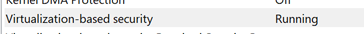

### &nbsp;&nbsp;&nbsp;&nbsp;&nbsp;&nbsp;&nbsp;✨ให้ใช้ [&nbsp; Batch Script นี้&nbsp;](./scripts/TurnOffHyperV.bat)ในการ Disable โดยจะต้อง Reboot เครื่องเมื่อทำการใช้งาน Script เสร็จแล้ว

- **หากต้องการปิดเองแบบ Manual ให้ปิดสิ่งเหล่านี้**
  - &nbsp;**Windows Features**
    - &nbsp;Hyper-V
    - &nbsp;Virtual Machine Platform
    - &nbsp;Windows Hypervisor Platform
    - &nbsp;Windows Sandbox
    - &nbsp;Windows Subsystem for Linux
  - &nbsp;**Windows Security**
    - Core Isolation (Memory Integrity)
  - &nbsp;**Local Group Policy Editor**
    - &nbsp;Computer Configuration
      - &nbsp;Administrative Templates
        - &nbsp;System
          - &nbsp;Device Guard
            - &nbsp;Turn On Virtualization Based Security แล้วเลือก Disable
  - &nbsp;**CMD**: `bcdedit /set hypervisorlaunchtype off`

## Setup - เตรียมการติดตั้ง

1. เริ่มต้นด้วยการ Download ไฟล์ติดตั้ง VMware ESXi โดยสามารถ Download ได้จากที่นี่
    - **x86_64 - Intel/AMD**: [VMware VMvisor Installer 8.0U3b x86_64.iso](https://fs-bucket.jarukrit.net/ESXi/VMware-VMvisor-Installer-8.0U3b-24280767.x86_64.iso)
    - ~~**ARM64 - Apple Silicon**: [VMware VMvisor Installer 8.0U3c AArch64.iso](https://fs-bucket.jarukrit.net/ESXi/VMware-VMvisor-Installer-8.0U3c-24449057.aarch64.iso) (เวอร์ชั่น Technical Preview อาจจะเจอบัค)~~ ใช้งานไม่ได้บน Mac
2. สร้าง Virtual Machine โดยใช้ VMware Workstation เลือก &nbsp;`New Virtual Machine...`<br/><br/>
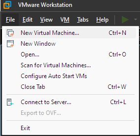

3. เลือก `Typical (recommended)`<br/><br/>
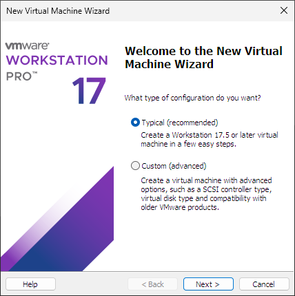

3. เลือก Install disc image file เป็นไฟล์ ISO ของ ESXi ที่ได้ Download มา<br/><br/>
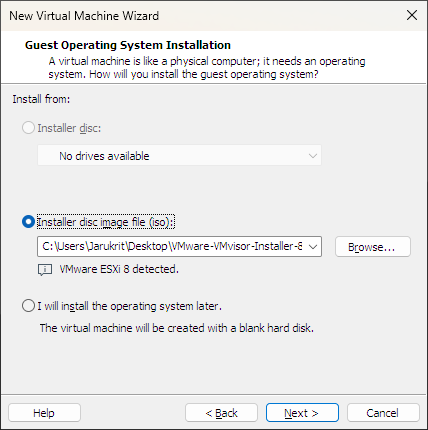

4. ตั้งชื่อ VM เป็นรูปแบบ `รหัสนักศึกษา-ESXi` เช่น 66070999-ESXi<br/><br/>
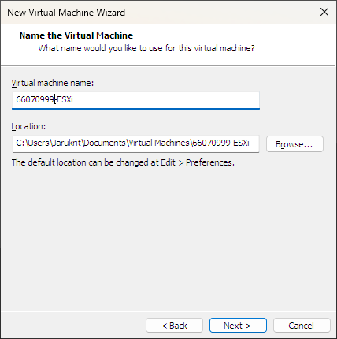

5. ใช้ค่า Disk Size ที่กำหนดมาให้ คือ 142.0 GB (VMware จะไม่ใช้พื้นที่จำนวนนั้นทันที่ เพราะเป็นการ Allocate แบบ Dynamic ใช้พื้นที่แค่เท่าที่ VM นั้น ๆ ใช้)<br/><br/>
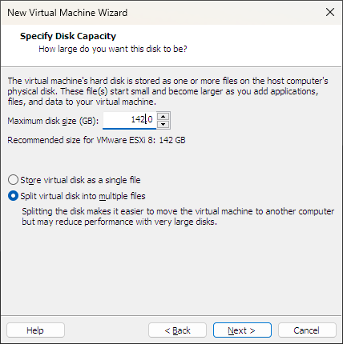

6. เมื่อมาถึงหน้า Summary แล้วเลือก `Customize Hardware...` เพื่อปรับประสิทธิภาพให้ดียิ่งขึ้น<br/><br/>
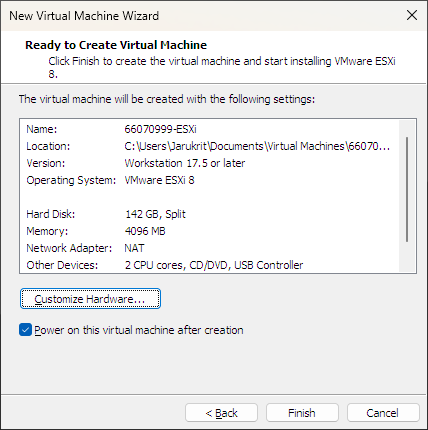

7. ปรับค่า Memory เป็น 8 GB (คอมในห้อง Lab มี RAM 16 GB)<br/><br/>
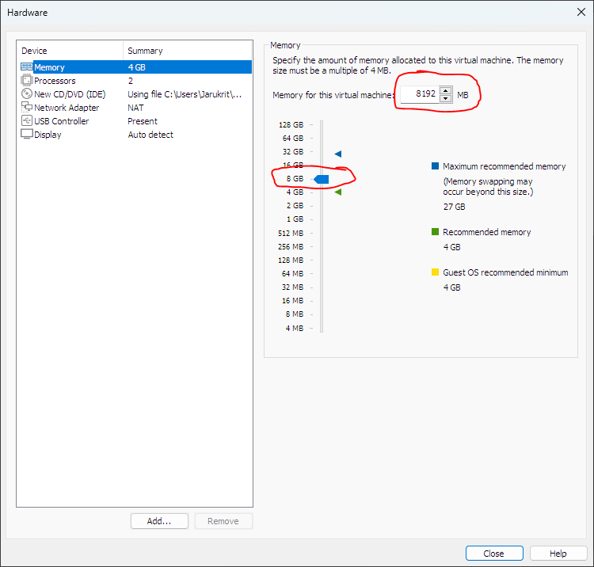

8. ปรับค่า Processors เป็น 1 Processors 6 Cores<br/><br/>

> [!IMPORTANT]
> ต้องเปิดการตั้งค่า Virtualize Intel VT-x/EPT or AMD-V/RVI ไม่งั้น ESXi จะไม่สามารถทำงานได้

   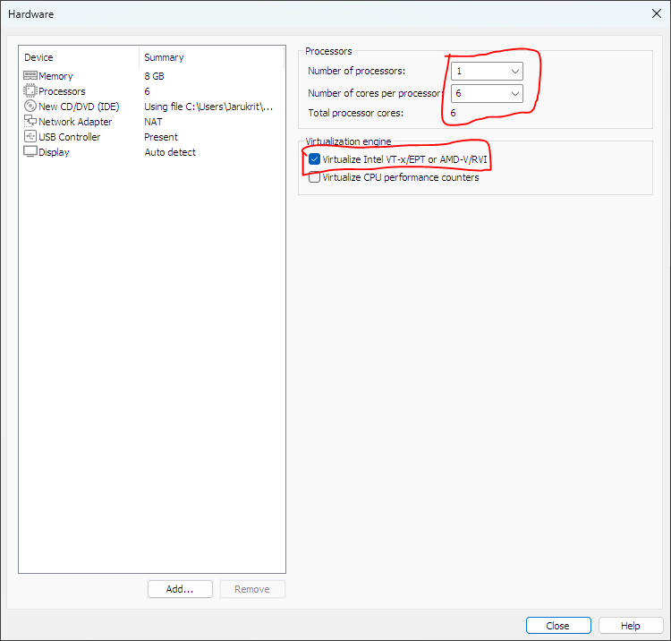

9. กด Close และกด Finish

10. หากเปิด VM แล้วพบ Error นี้ ให้เลือก No แล้วกลับไปทำขั้นตอน [Prerequisite - ข้อกำหนดเบื้องต้น](#prerequisite---ข้อกำหนดเบื้องต้น) ใหม่<br/><br/>
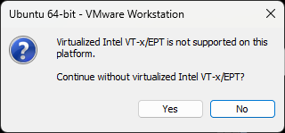

## Installation - การติดตั้ง

1. ทำการ Start Virtual Machine และจะพบกับหน้านี้<br/><br/>


> [!IMPORTANT]
> เน้นย้ำว่าต้องเพิ่ม Boot Options `Shift + O` ไม่งั้นที่เก็บจะไม่พอสร้าง VM เพิ่มครับ

2.  กด `Shift + O` เพื่อเพิ่ม Boot options และใส่ Boot Option ดังนี้ และกด Enter:

    ```
    autoPartitionOSDataSize=4096 allowLegacyCPU=true
    ```

    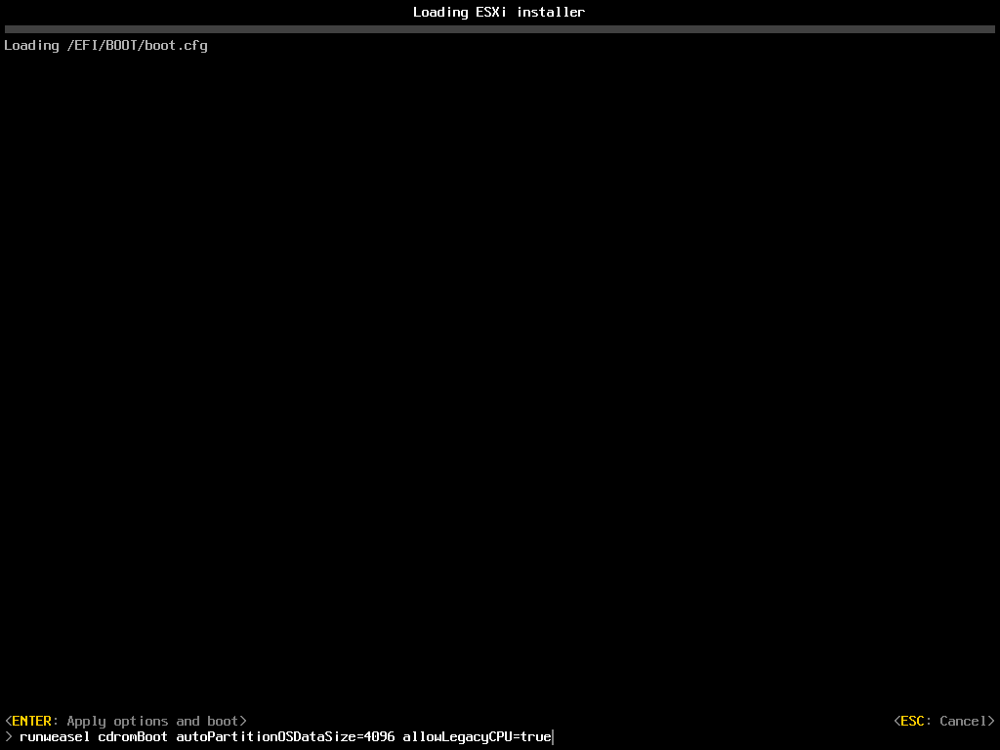

    *   `autoPartitionOSDataSize=4096`:  กำหนดขนาด (เป็น MB) ของพาร์ติชัน VMFSL (VMware File System Layer) ซึ่งเป็นพาร์ติชันที่ ESXi ใช้เก็บข้อมูลการกำหนดค่า, logs, และ VMFS datastore ค่าเริ่มต้นคือ 138GB, แต่ในที่นี้เราตั้งค่าเป็น 4096 MB (4GB) เพื่อประหยัดพื้นที่
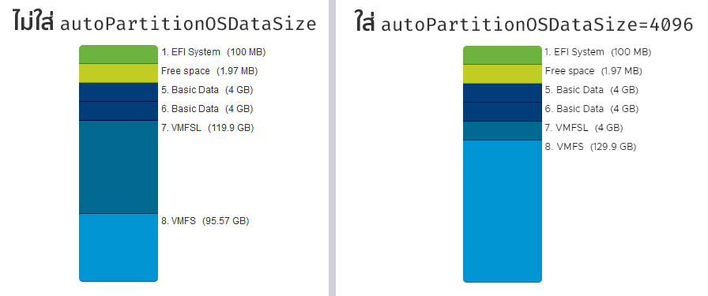

    *   `allowLegacyCPU=true`:  อนุญาตให้ ESXi ติดตั้งและทำงานบน CPU รุ่นเก่าที่อาจไม่ได้รับการสนับสนุนอย่างเป็นทางการ

3. เมื่อ Install ทำงานเสร็จสิ้นจะพบกับหน้านี้ และกด Enter<br/><br/>
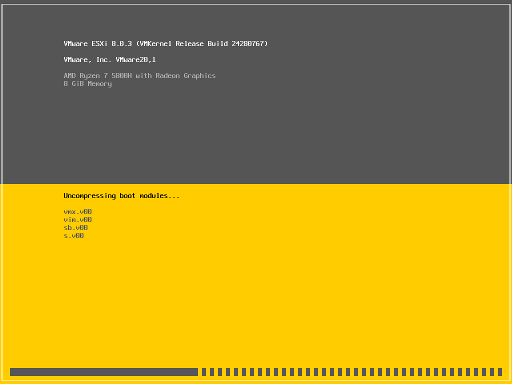<br/><br/>
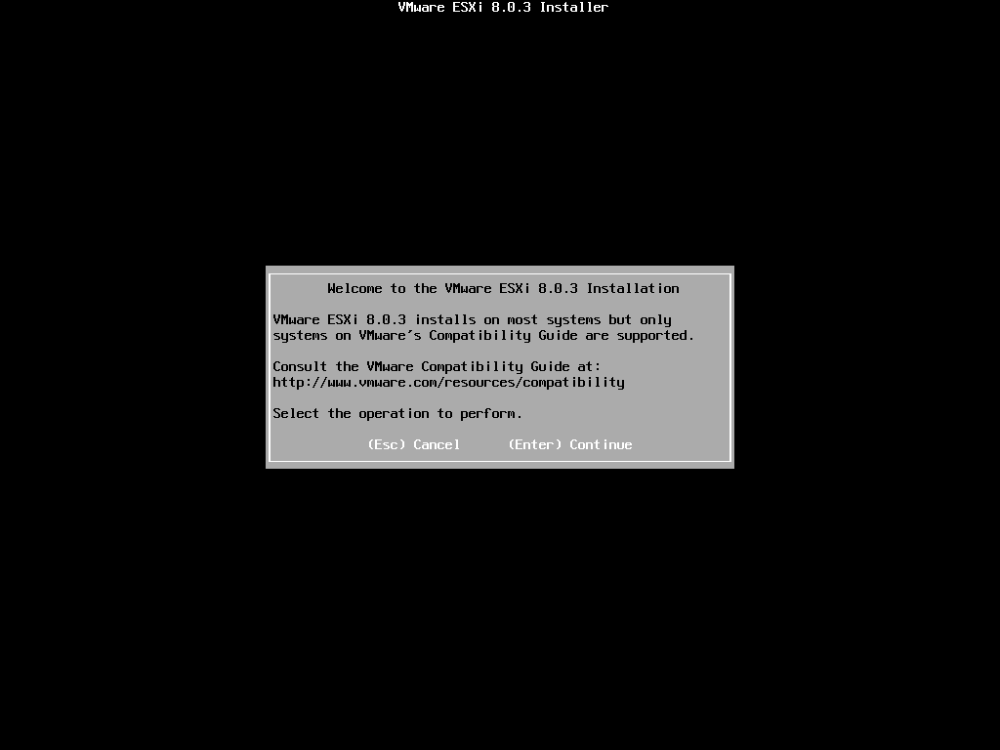

4. จากนั้นกด F11 เพือยอมรับ EULA<br/><br/>
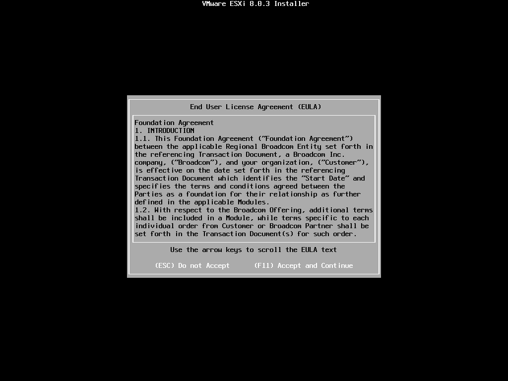

5. รอ Scan หา Media สำหรับใช้ติดตั้ง เมื่อ Scan เสร็จกด Enter เพื่อเลือก Media นั้น ๆ และไปต่อ<br/><br/>
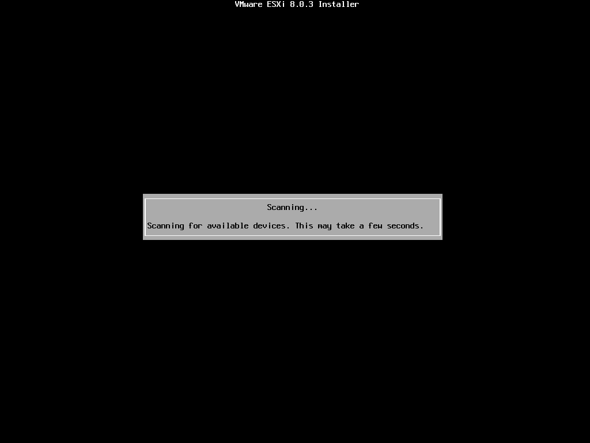<br/><br/>
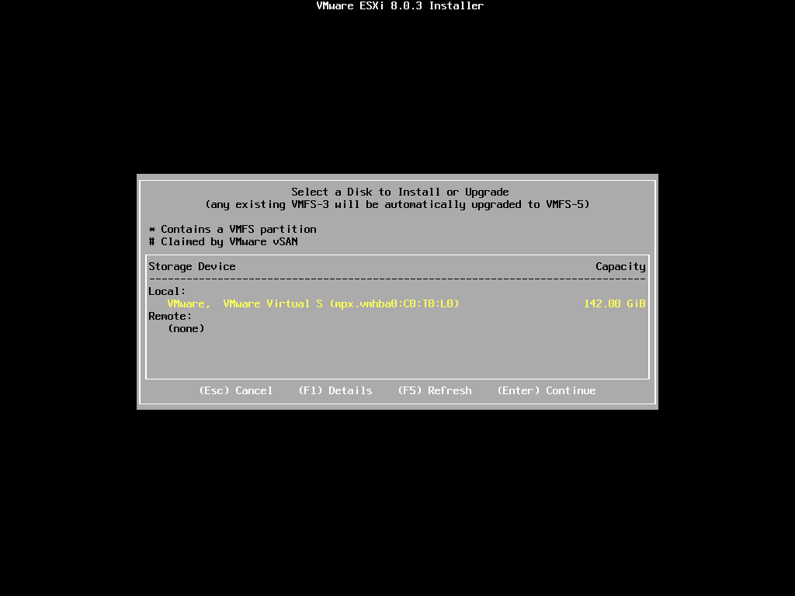

6. เลือก Default Keyboard Layout<br/>
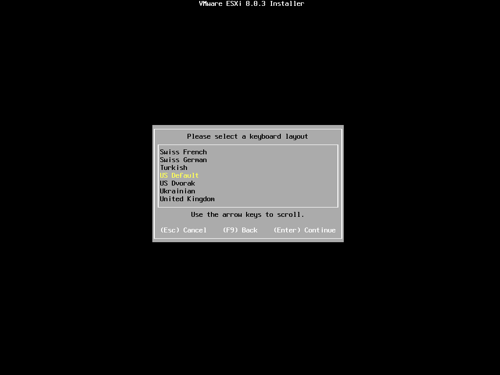

7. ใส่ Root Password ที่จดจำได้ โดยรหัสต้องมีความยาวอย่างน้อย 7 ตัวอักษร
    - โดยประกอบด้วย
        - ตัวพิมพ์ใหญ่ (ABC...)
        - ตัวพิมพ์เล็ก (abc...)
        - ตัวเลข (123...)
        - ตัวอักษรพิเศษ (!@#$%...)
<br/><br/>


> [!IMPORTANT]
> หากลืมรหัสผ่านนี้จะไม่สามารถใช้งาน ESXi ได้


8. จากนั้นทำการยืนยันการติดตั้ง ด้วยการกด F11 <br/><br/>
<br/><br/>
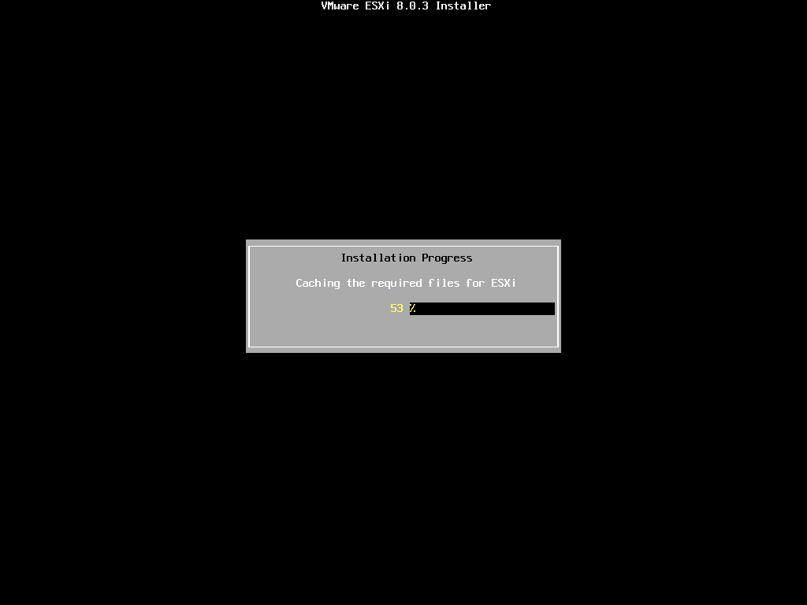

9. สุดท้ายทำการกด Enter เพื่อ Reboot และเริ่มใช้งาน<br/><br/>
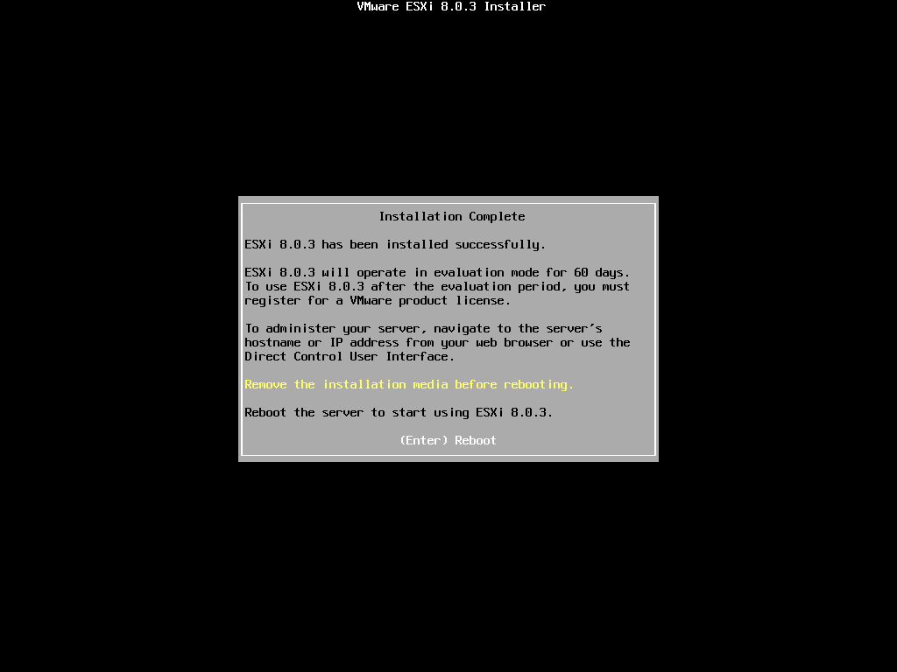

10. ถ้าทุกอย่างสมบูรณ์ จะพบกับหน้านี้<br/><br/>
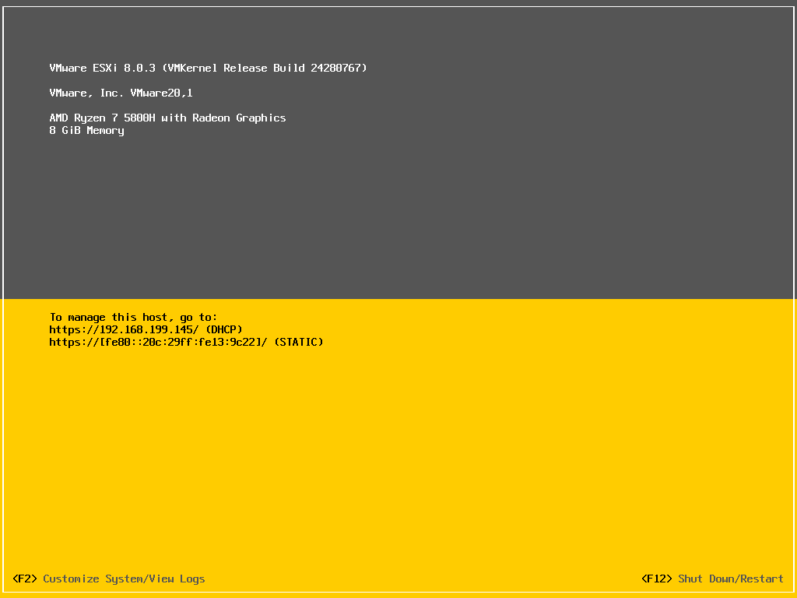


# Section 2: ESXi Basics

## Interacting with Web Console - เข้าใช้งานผ่าน Console

1. นำ IP Address ที่ปรากฏในหน้าของ VM Console ไปใส่ใน Browser และใส่รหัส root ที่ได้กรอกไว้ก่อนหน้า โดย Username: `root`<br/><br/>
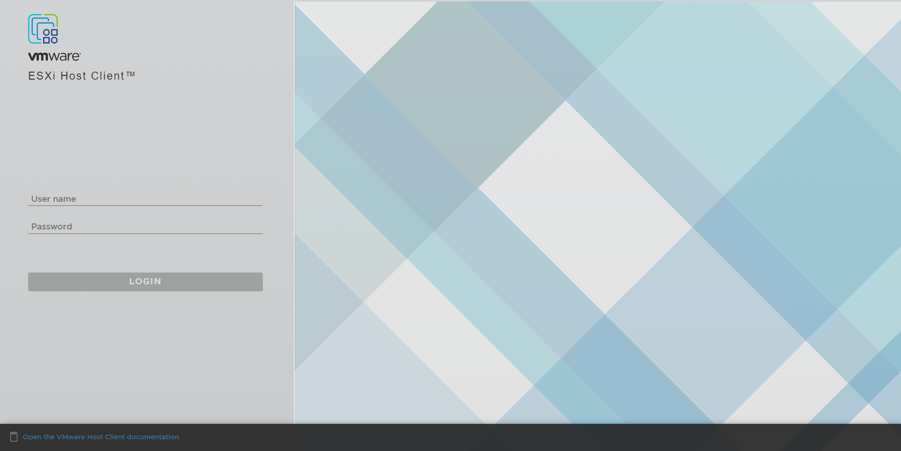

2. เมื่อ Login ครั้งแรก นำตัวเลือก Join the VMware Customer Experience Improvement Program **ออก** และกด OK<br/><br/>
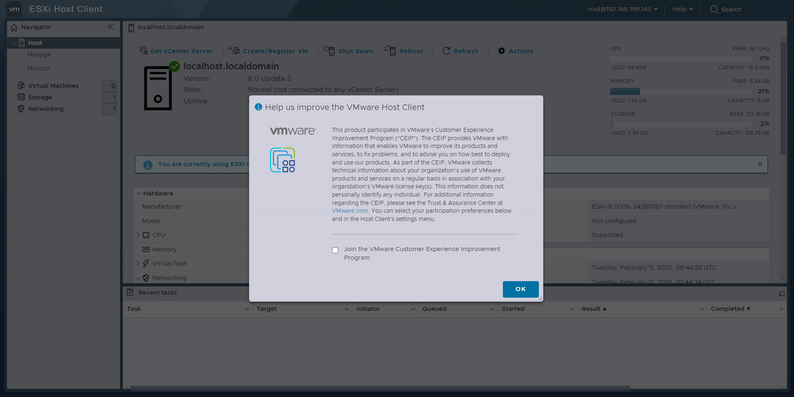

3. เริ่มใช้งานได้เลย<br/><br/>
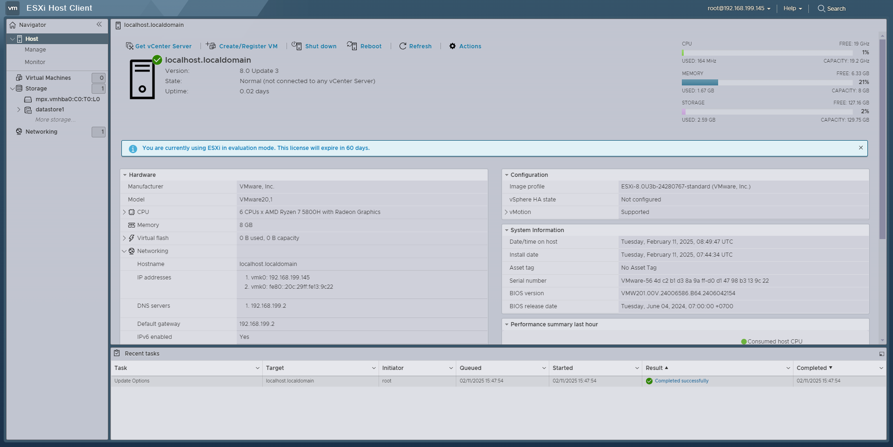

4. อัพโหลด ISO สำหรับติดตั้ง OS ต่าง ๆ ได้ด้วยการไปที่<br/>
`Storage > datastore1 > Datastore Browser` แล้วเลือก `Upload`
- โดยสามารถ Download ISO ต่าง ๆ ได้ดังนี้
    - **Ubuntu**: [https://ubuntu.com/download/](https://ubuntu.com/download/)
    - **Windows 10**: [https://drive.massgrave.dev/en-us_windows_10_iot_enterprise_ltsc_2021_x64_dvd_257ad90f.iso](https://drive.massgrave.dev/en-us_windows_10_iot_enterprise_ltsc_2021_x64_dvd_257ad90f.iso)
    - **Windows 11**: [https://oemsoc.download.prss.microsoft.com/dbazure/X23-81951_26100.1742.240906-0331.ge_release_svc_refresh_CLIENT_ENTERPRISES_OEM_x64FRE_en-us.iso](https://oemsoc.download.prss.microsoft.com/dbazure/X23-81951_26100.1742.240906-0331.ge_release_svc_refresh_CLIENT_ENTERPRISES_OEM_x64FRE_en-us.iso_640de540-87c4-427f-be87-e6d53a3a60b4?t=2c3b664b-b119-4088-9db1-ccff72c6d22e&P1=102816950270&P2=601&P3=2&P4=OC448onxqdmdUsBUApAiE8pj1FZ%2bEPTU3%2bC6Quq29MVwMyyDUtR%2fsbiy7RdVoZOHaZRndvzeOOnIwJZ2x3%2bmP6YK9cjJSP41Lvs0SulF4SVyL5C0DdDmiWqh2QW%2bcDPj2Xp%2bMrI9NOeElSBS5kkOWP8Eiyf2VkkQFM3g5vIk3HJVvu5sWo6pFKpFv4lML%2bHaIiTSuwbPMs5xwEQTfScuTKfigNlUZPdHRMp1B3uKLgIA3r0IbRpZgHYMXEwXQ%2fSLMdDNQthpqQvz1PThVkx7ObD55CXgt0GNSAWRfjdURWb8ywWk1gT7ozAgpP%2fKNm56U5nh33WZSuMZIuO1SBM2vw%3d%3d)
    - **Windows อื่น ๆ**: [https://massgrave.dev/genuine-installation-media](https://massgrave.dev/genuine-installation-media)

<br/><br/>
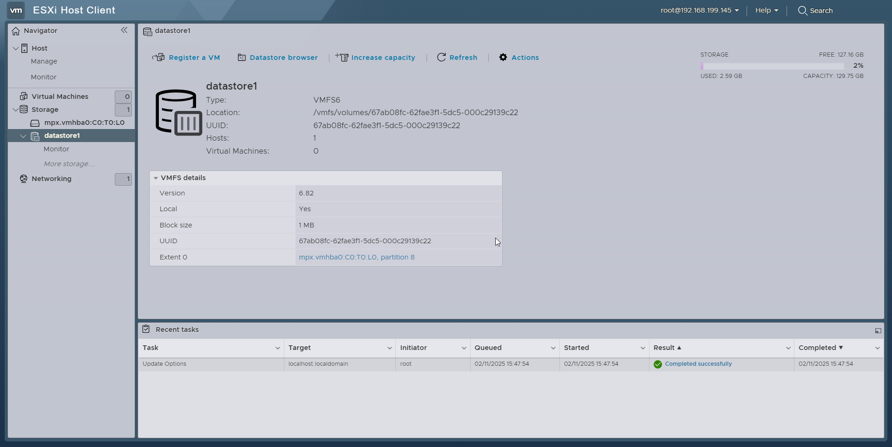<br/><br/>
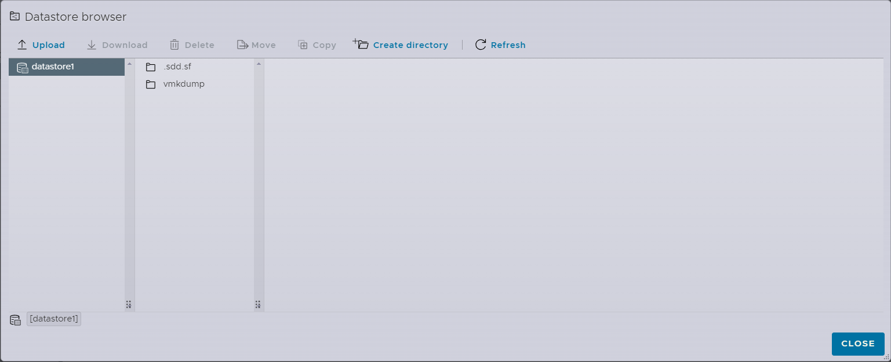

5. สร้าง Virtual Machine ใหม่ ด้วยการกด `Create / Register VM`<br/><br/>
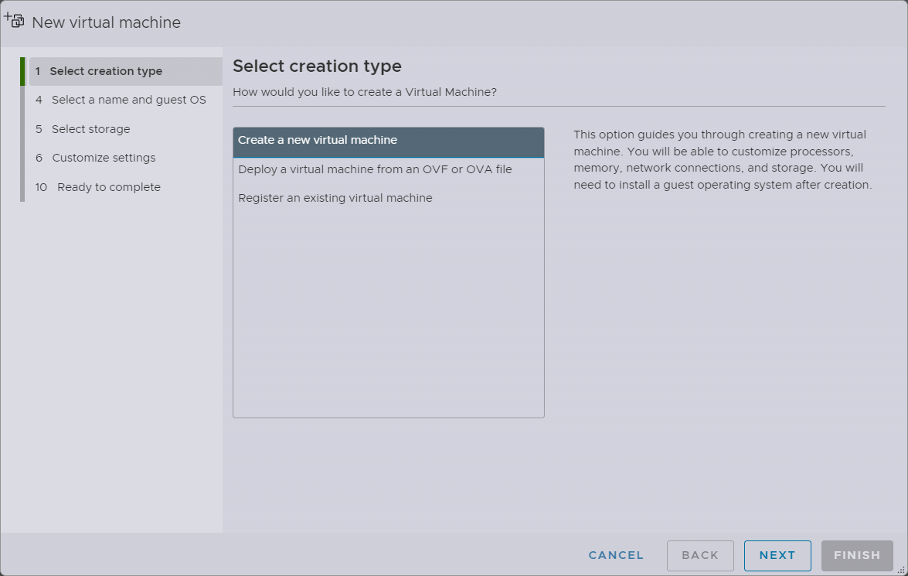

6. ตั้งชื่อ Virtual Machine และเลือก OS ที่ใช้<br/><br/>
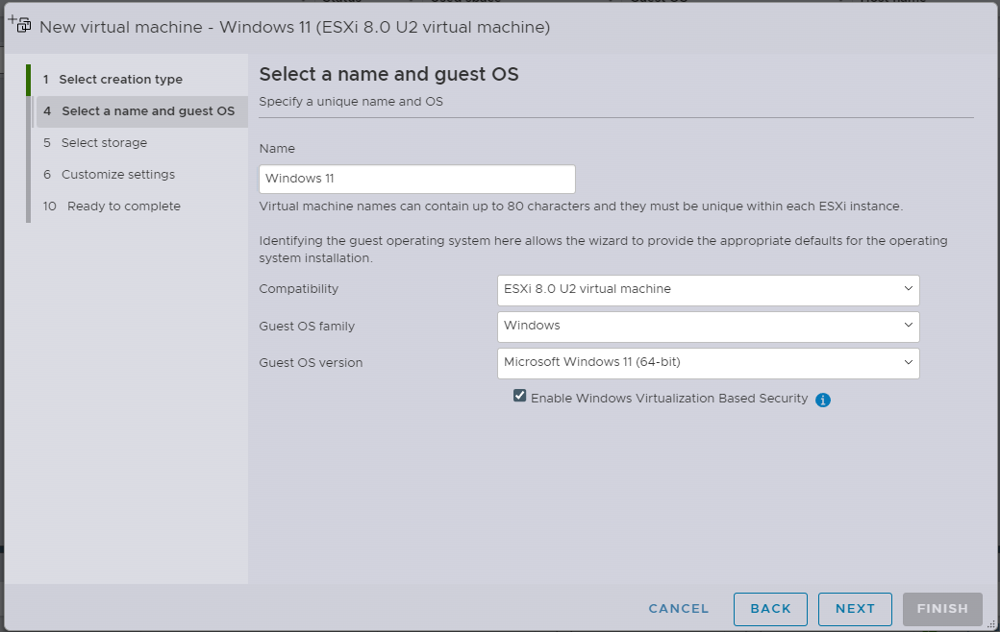

7. เลือก Datastore ที่ต้องการใช้จัดเก็บ Virtual Machine นั้น ๆ<br/><br/>
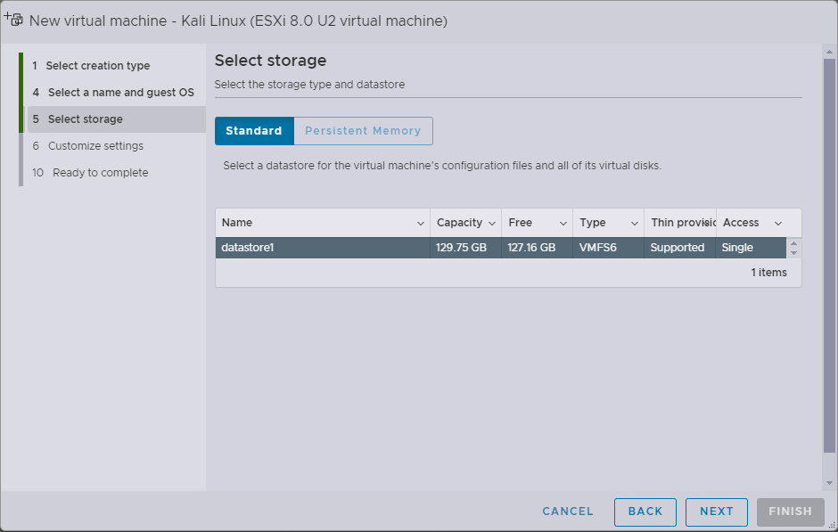

8. ปรับค่า Virtual Machine เช่นให้ CPU, RAM หรือ Storage เพิ่ม<br/><br/>
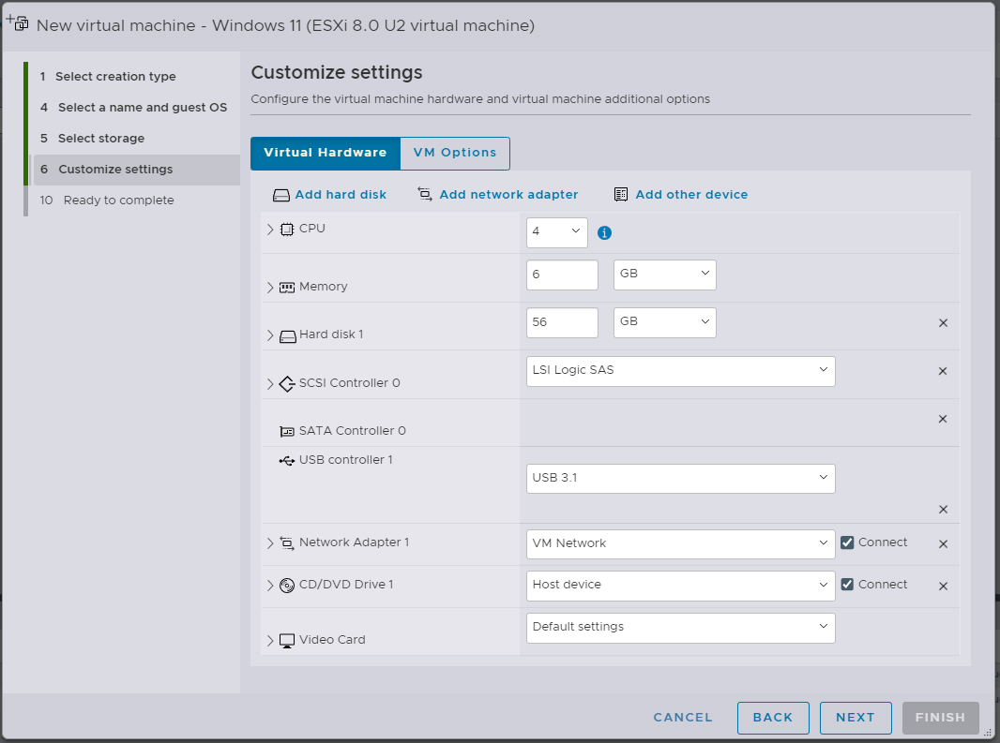

9. ทำการเพิ่ม ISO สำหรับติดตั้ง OS ของ Virtual Machine โดยการเปลี่ยนจาก `Host device` เป็น `Datastore ISO file` และเลือก ISO ที่ได้ทำการอัพโหลดจากขั้นตอนที่ 4<br/><br/>
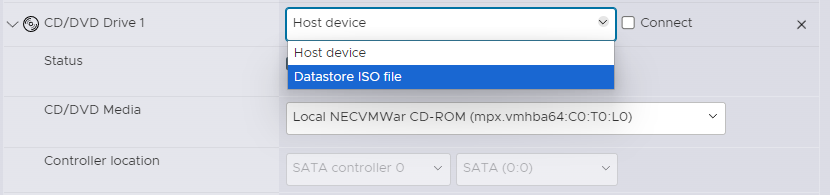<br/><br/>
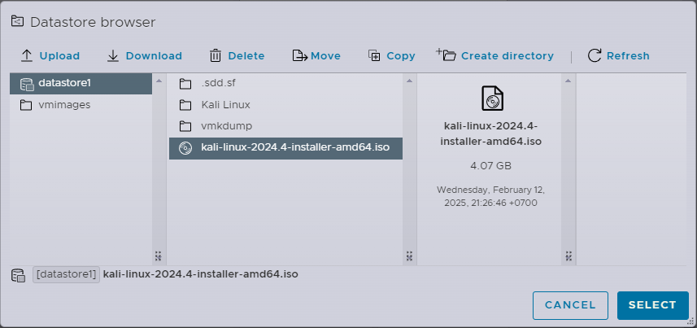<br/><br/>
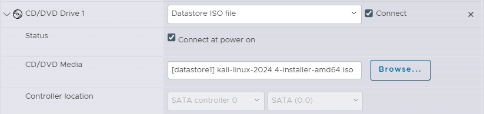

> [!IMPORTANT]
> อย่าลืมเลือก ✅ Connect และ ✅ Connect at power on ด้วย

10. ตรวจสอบและยืนยันการตั้งค่า<br/><br/>
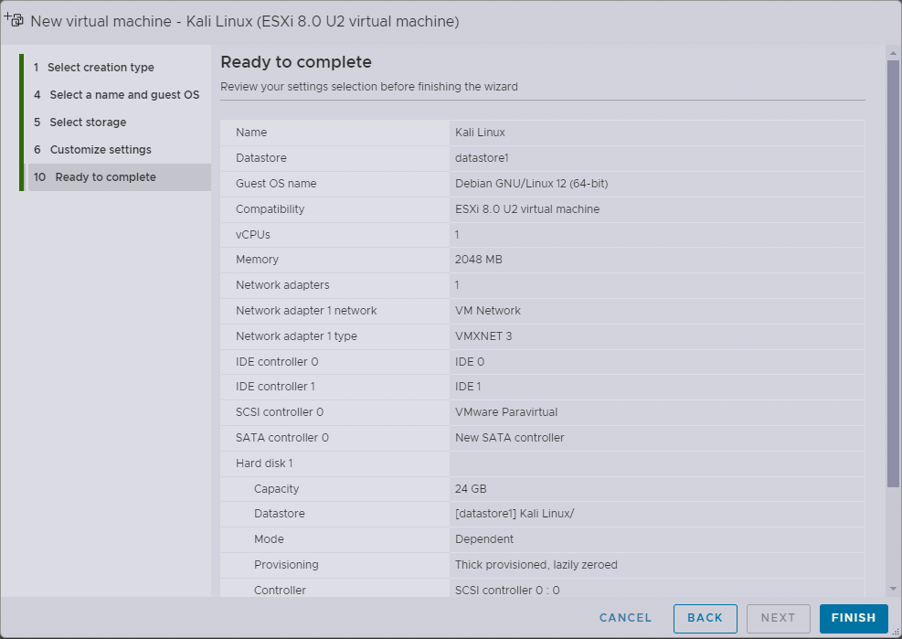

11. Virtual Machine ได้ถูกสร้างขึ้นสำเร็จแล้ว<br/><br/>


12. กด Power On เพื่อเริ่ม Virtual Machine<br/><br/>
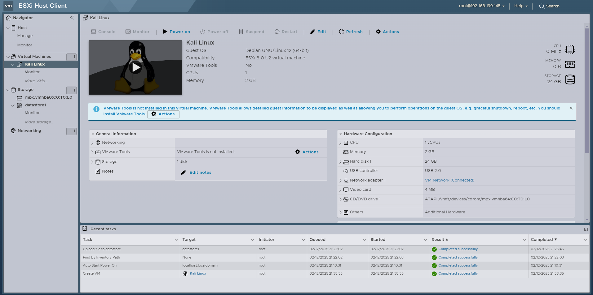

13. จากนั้นจะมี Pop-up สำหรับ Remote Console ขึ้นมา และสามารถเริ่มการติดตั้งได้เลย<br/><br/>
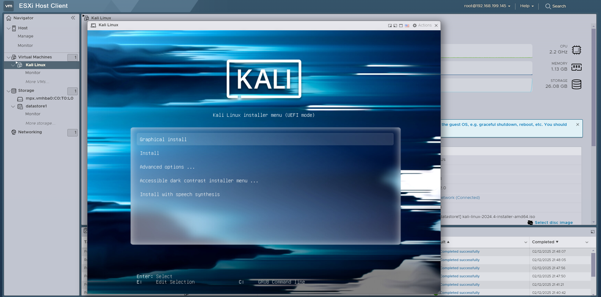

## 14. หาก Download ISO Windows 11 จากด้านบน กรุณาใช้ Windows 11 IoT Enterprise Edition นะครับ

> [!TIP]
> เพื่อประสิทธิภาพการใช้งานที่ดี (เช่น การปรับขนาดหน้าจอได้) ควรติดตั้ง VMware Tools หลังติดตั้ง OS เสร็จสิ้น
> - [วิธีสำหรับ Windows Guest](https://youtu.be/njK5Em1H5Po?feature=shared&t=25)
> - [วิธีสำหรับ Linux Guest](https://techdocs.broadcom.com/us/en/vmware-cis/vsphere/tools/11-1-0/vmware-tools-administration-11-1-0/installing-vmware-tools/install-open-vm-tools.html)

# Section 3: VM Snapshot
Snapshots ใน ESXi คือการจับภาพสถานะของ VM ณ เวลาใดเวลาหนึ่ง เพื่อให้สามารถย้อนกลับ (revert) ไปยังสถานะนั้นได้อย่างรวดเร็ว เหมาะสำหรับการทดสอบ, การพัฒนา, หรือการ rollback ชั่วคราว, *แต่ไม่ใช่* การสำรองข้อมูล (backup) ที่สมบูรณ์


1. สามารถทำ Snapshot ได้ด้วยการคลิกขวาที่ชื่อ VM และกด Take Snapshot<br/><br/>
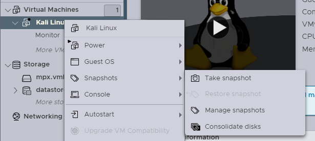

2. ทำการตั้งชื่อและตั้งรายละเอียดประกอบ Snapshot นั้น<br/><br/>
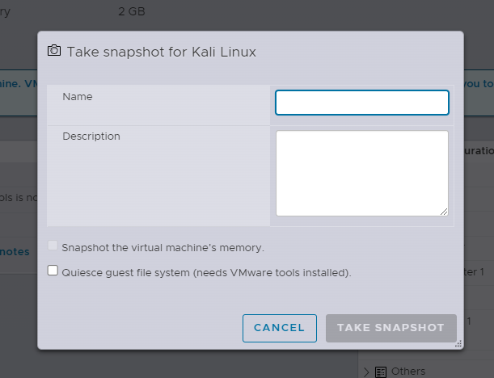

3. คลิกขวาและกด Manage Snapshot เพื่อตรวจสอบ Snapshot ที่มีใน VM นั้น ๆ<br/><br/>
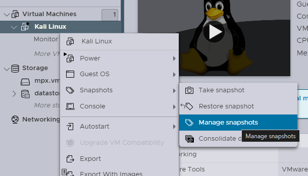<br/><br/>
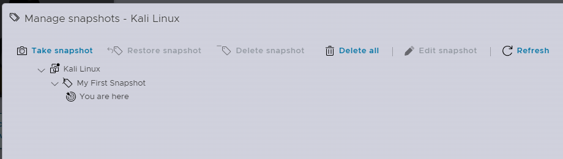

4. เลือก Snapshot ที่ต้องการ Restore และกด Restore Snapshot<br/><br/>
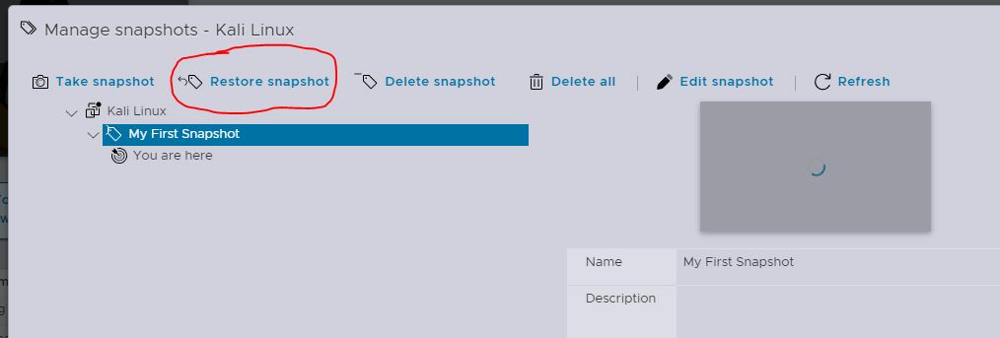