# Computer Organization and Operating System Lab #13

# Section 0: Introduction

## What is Docker

<p align="center">

</p>

**Docker** คือแพลตฟอร์ม Containerization ที่ช่วยให้คุณสามารถ สร้าง, จัดการ, และรันแอปพลิเคชันในสิ่งที่เรียกว่า "Containers" ได้อย่างรวดเร็ว, สอดคล้อง, และมีประสิทธิภาพ ลองนึกภาพว่า Docker เป็นเหมือน "กล่องคอนเทนเนอร์สำหรับการขนส่งซอฟต์แวร์" ที่ทำให้การเคลื่อนย้ายและใช้งานแอปพลิเคชันเป็นเรื่องง่าย ไม่ว่าคุณจะอยู่ที่ไหน หรือใช้ infrastructure แบบใดก็ตาม

**Virtual Machines (VMs)** จำลองฮาร์ดแวร์ทั้งเครื่อง ทำให้แต่ละ VM ต้องมีระบบปฏิบัติการเต็มรูปแบบของตัวเอง, ในขณะที่ Docker ใช้ Containerization จำลองแค่ระดับระบบปฏิบัติการ ทำให้ Containers แชร์ Kernel ของ Host OS และมีขนาดเล็กกว่า, เริ่มเร็วกว่า, และใช้ทรัพยากรน้อยกว่า VMs มาก

<p align="center">


</p>

<h2 align="center">Relatable Image</h2>

<p align="center">
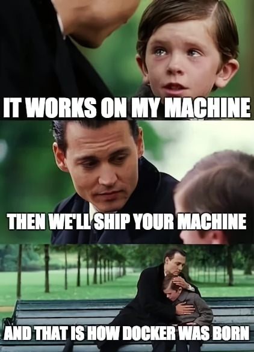
</p>

Source: [reddit - /r/ProgrammerHumor](https://www.reddit.com/r/ProgrammerHumor/comments/y8qylu/docker_is_born/?ref=share&ref_source=link)


# Section 1: Preparation

## เปิด WSL 2 และ Hyper-V

### &nbsp;&nbsp;&nbsp;✨ให้ใช้ [&nbsp; Batch Script นี้&nbsp;](./scripts/TurnOnHyperV.bat)ในการ เปิด WSL 2 และ Hyper-V โดยจะต้อง Reboot เครื่องเมื่อทำการใช้งาน Script เสร็จแล้ว

## ติดตั้ง Docker Desktop

- [Docker Desktop for Window-x86_64](https://docs.docker.com/desktop/setup/install/windows-install/)
- [Docker Desktop for MacOS](https://docs.docker.com/desktop/setup/install/mac-install/)
- [Docker Desktop for Linux](https://docs.docker.com/desktop/setup/install/linux/)

## ติดตั้ง Node.js เวอร์ชั่น LTS

- [Node.js](https://nodejs.org/en/download)<br/>
  <br/>
  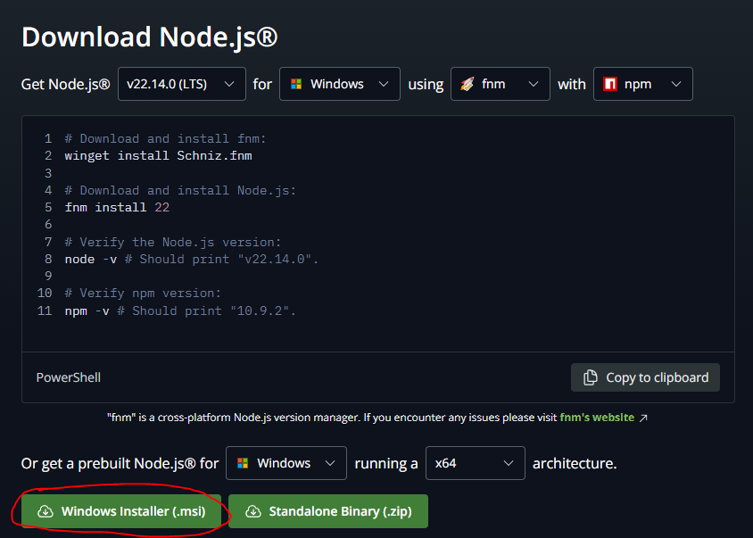

## Set Up

### Docker Desktop

1.  Run Docker Desktop Installer.exe

### Node.js

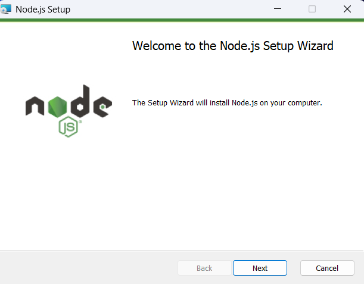

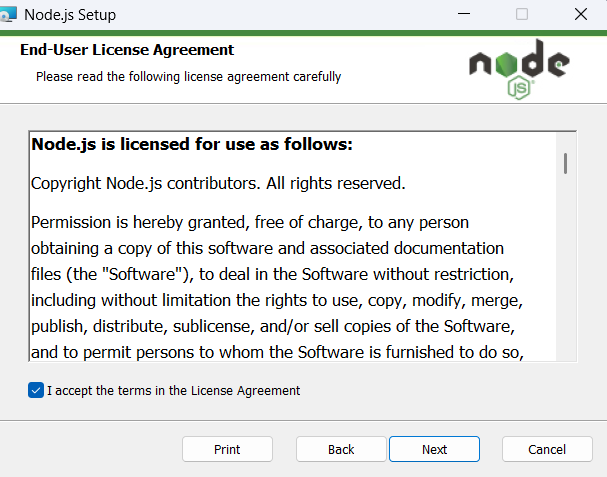


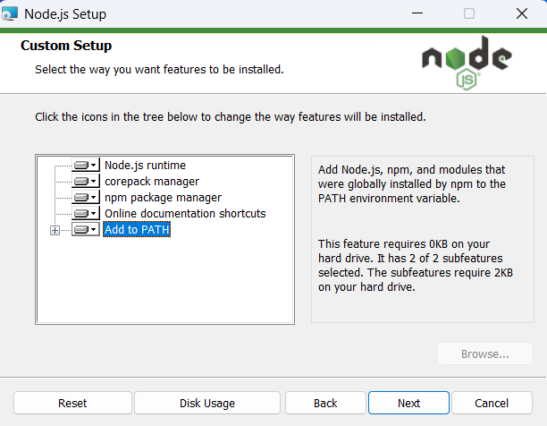

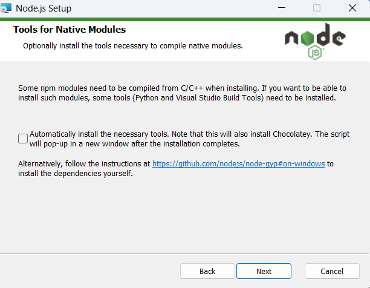


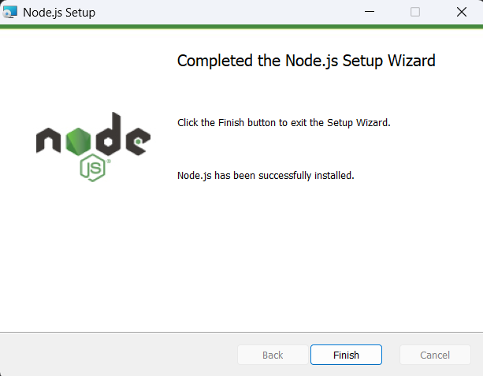

#### Check Node.js Version

```bash
node -v
```

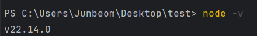

#### Check NPM Version

```bash
npm -v
```

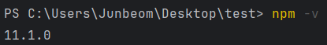

## Section 2: Docker Basics

### 0. สร้าง Folder เปล่า ๆ สำหรับทำ Lab นี้ แล้วเข้าไปใน Folder นั้น อาจจะใช้ VSCode หรือ IDE ที่ถนัด

### 1. สร้างไฟล์ package.json

ด้วยคำสั่ง `npm init` และกด Enter เพื่อยืนยันชื่อและข้อมูลต่าง ๆ

```bash
npm init
```

เมื่อทำเสร็จแล้ว จะได้ไฟล์ `package.json` ดังภาพ<br/><br/>
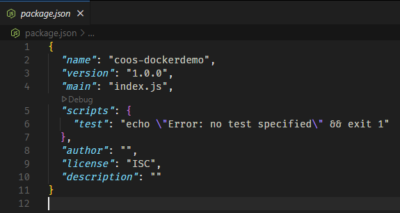

### 2. ติดตั้ง Express.js เวอร์ชั่น 4 และ EJS

```bash
npm i express@^4 ejs
```

### 3. สร้างไฟล์ index.js และ ejs views

### โดยมีโครงสร้าง Folder ดังนี้<br/>

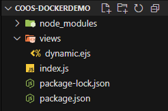

#### index.js

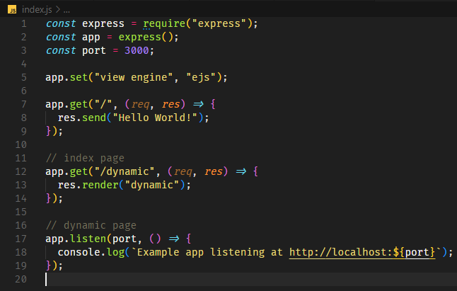

#### dynamic.ejs

```html
<!DOCTYPE html>
<html lang="en">
  <head>
    <meta charset="UTF-8" />
    <meta name="viewport" content="width=device-width, initial-scale=1.0" />
    <title>Dynamic Content</title>
  </head>
  <body>
    <h1>Dynamic Content with EJS</h1>
    <h2>Random Number Generator</h2>
    <%= Math.floor(Math.random() * 100) + 1 %>
  </body>
</html>
```

### 4. เริ่มใช้งาน Node.js Application

โดยเบื่องต้นจะใช้คำสั่ง `node` ตามด้วยชื่อไฟล์ JavaScript ที่ต้องการเรียกใช้งาน

```bash
node index.js
```

ถ้าเรียกใช้สำเร็จจะได้ Console Output แบบนี้ <br/><br/>
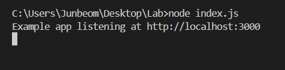

ลองทำการเข้าเว็บไซต์ที่เราสร้างขึ้นมา ด้วยการเปิด [http://localhost:3000](http://localhost:3000) ซึ่งจะได้หน้า index ดังรูป

#### [index page](http://localhost:3000)

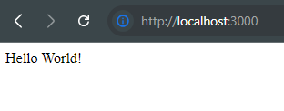

#### [dynamic page](http://localhost:3000/dynamic)

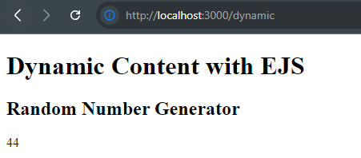

### เพิ่ม Script สำหรับ Start App ใน package.json

`scripts` ใน `package.json` คือส่วนที่กำหนด คำสั่งลัด สำหรับรัน task ต่าง ๆ ในโปรเจกต์ เช่น เริ่มเซิร์ฟเวอร์, dev, build หรือ test ช่วยให้เรียกใช้คำสั่งเหล่านี้ได้ง่ายด้วย `npm run <ชื่อ script>` แทนที่จะพิมพ์คำสั่งยาว ๆ เอง เหมือนเป็น shortcut

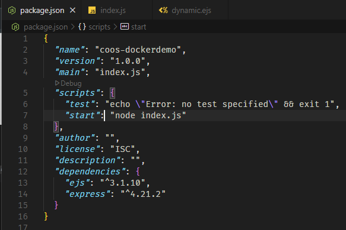

### Run Node.js Application ด้วยคำสั่ง NPM

หยุด Process เก่าด้วยการกด `Ctrl + C` ใน Terminal (ถ้ายังทำงานอยู่) แล้วลองใช้คำสั่งนี้ ผลลัพธ์จะเหมือนคำสั่ง `node index.js`

```bash
npm run start
```

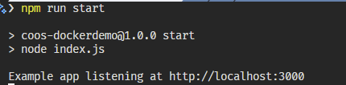

### 5. สร้าง Dockerfile เพื่อเตรียมนำ App เข้า Container
สร้างไฟล์ชื่อว่า `Dockerfile` ขึ้นมาใน Project และระบุคำสั่งดังนี้<br/><br/>

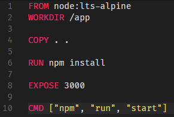

#### คำสั่งใน Dockerfile นี่คืออะไร

- **`FROM node:lts-alpin`**: **ตั้งต้นจาก Base Image:** ใช้ Docker Image `node:lts-alpin` เป็น Base ซึ่งเป็น Image ที่มี Node.js (เวอร์ชัน LTS - Long Term Support) และ npm ติดตั้งไว้แล้ว และใช้ระบบปฏิบัติการ Alpine Linux ที่มีขนาดเล็ก
- **`WORKDIR /app`**: **กำหนด Working Directory:** เปลี่ยน Directory ทำงานปัจจุบันภายใน Container ไปที่ `/app` คำสั่งต่อจากนี้จะทำงานใน Directory นี้ (เปรียบเสมือนการ `cd /app`)
- **`COPY . .`**: **คัดลอกไฟล์ทั้งหมด:** คัดลอกไฟล์และโฟลเดอร์ทั้งหมดจาก **current directory** (ที่อยู่ของ Dockerfile) บนเครื่อง Host ไปยัง **`/app`** directory ใน Container
- **`RUN npm install`**: **ติดตั้ง Dependencies:** สั่งรันคำสั่ง `npm install` ภายใน Container เพื่อติดตั้ง Node.js dependencies ที่ระบุไว้ใน `package.json` ของโปรเจกต์
- **`EXPOSE 3000`**: **เปิด Port:** ประกาศว่า Container จะ Listen บน Port `3000` (เป็นการบอก Docker เฉยๆ ไม่ได้ Publish Port จริงๆ)
- **`CMD ["npm", "run", "start"]`**: **คำสั่งเริ่มต้น Container:** กำหนดคำสั่งที่จะรันเมื่อ Container เริ่มทำงาน (โดย Script `start` ถูกกำหนดไว้ใน `package.json` เป็น `node index.js`)

### 6. Create .dockerignore

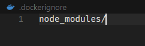

ทำงานเหมือน `.gitignore` โดยจะไม่ทำการคัดลอกไฟล์เข้าไปใน Container ตอน build โดยในที่นี่ใส่

```
node_modules/
```

เพื่อไม่ให้คัดลอก node_modules ไปยัง container เพราะ node_modules มักสร้างมาเฉพาะ OS/architecture ของเครื่อง host ซึ่งอาจไม่ตรงกับใน container และทำให้เกิดปัญหา runtime ได้

### 7. Build Docker Image

> [!WARNING]
> หากพบ Error แบบนี้ กรุณาตรวจสอบว่าเปิด Docker Desktop หรือยัง แล้วลองใหม่ <br/><br/>
> 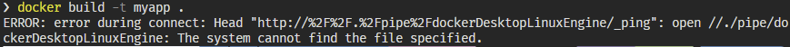

ใช้คำสั่งนี่เพื่อทำการ build docker image แรกของคุณ<br/><br/>
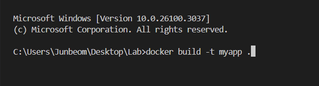

```
docker build -t [image-name]:[tag-name] .
```

- `-t myapp:v1` ตั้งชื่อ image ว่า myapp และเวอร์ชัน (tag) เป็น v1
  - ถ้าหากไม่ระบุ tag ไว้ tag จะถูกตั้งเป็น `latest` โดยอัตโนมัติ
- `.` บอกให้ใช้ไฟล์ในโฟลเดอร์ปัจจุบัน (ที่มี Dockerfile)<br/><br/>
  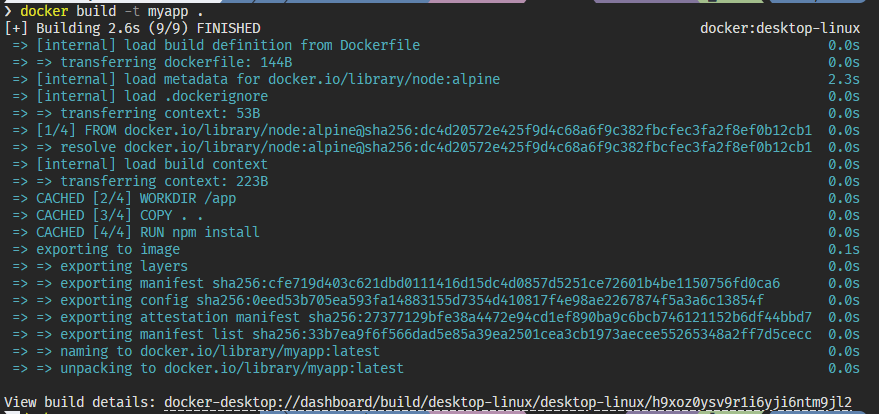

โดยสามารถดู logs การ build ได้จาก Docker Desktop เช่นกัน<br/><br/>
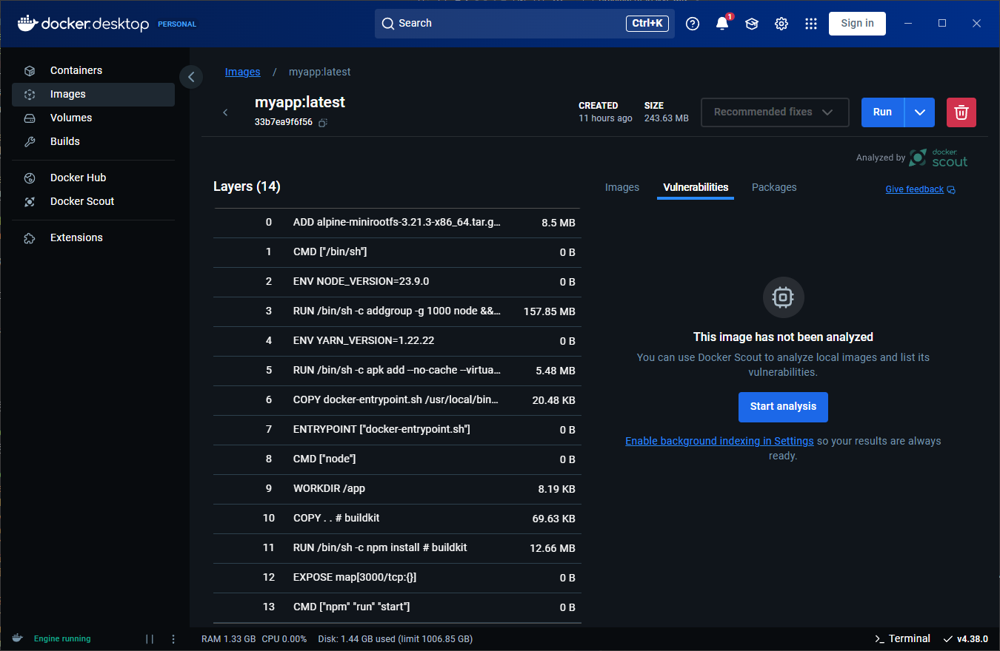

เช็คว่า Image ถูกสร้างขึ้นมาหรือยัง ด้วยคำสั่ง `docker images` หรือ `docker image ls`<br/><br/>
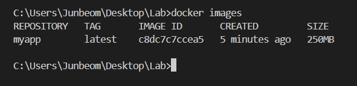<br/>

หรือดูจาก Docker Desktop ได้ในหน้านี้<br/><br/>
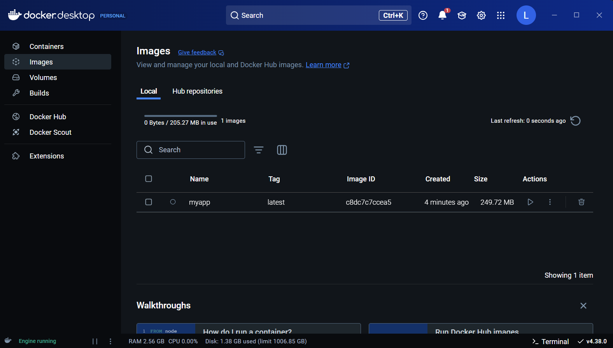

### 8. ทำการ Run Docker Container

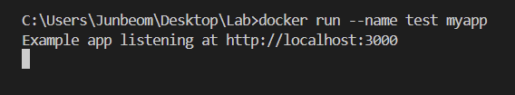

สร้างและรัน containerจาก image ที่เราสร้างไว้

```
docker run --name [name] [image-name]
```

> [!WARNING]
> หากทำการ run โดยใช้ชื่อซ้ำจะไม่สามารถ run ได้ ให้ stop container ที่ชื่อซ้ำแล้วลองใหม่ หรือตั้งชื่ออื่นแทน<br/><br/> 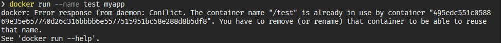

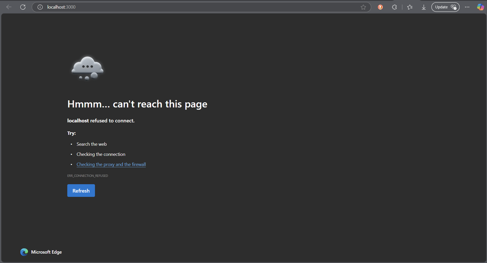
พบว่าหน้าเว็บไม่สามารถเข้าถึงได้เพราะเรายังไม่ได้เปิดพอร์ต 3000 ใน container ให้ Host เข้าถึงได้

### 9. ทำการ Publish Port เพื่อให้เข้าถึงจากภายนอกได้

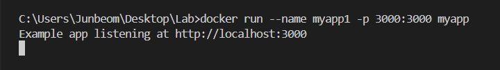

> [!NOTE]
> ถ้าพบ Error นี้ตอน run container ให้ตรวจสอบว่ามี Container หรือ Process อื่นกำลังใช้ Port 3000 อยู่ไหม ถ้ามีให้ทำการปิดหรือถ้าหาไม่เจอ เปลี่ยน Publish Port จาก 3000 เป็น 3001 ด้วย `-p 3001:3000` <br/><br/> 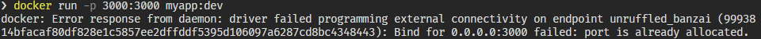

#### Port Mapping Example

ตัวอย่างภาพนี้คือการรัน Webserver สอง Container ที่ใช้ Port เดียวกันคือ 80 (Container Port) แต่ทำการ Publish Port ต่างกันก็คือ 8080 และ 8070 (Host Port)<br/><br/>


โดยคำสั่งนี้บอกให้เปิดพอร์ต 3000 ในเครื่องเรา และเชื่อมกับพอร์ต 3000 ใน container

```
docker run -p [host-port]:[container-port] [image-name-with-tag]
```

#### Index Page

<br/>

#### Dynamic Page

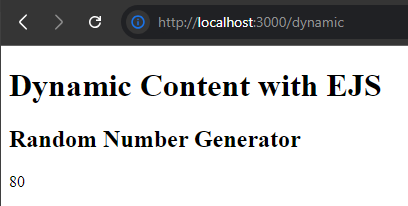

### 10. แสดง Container ที่กำลังทำงานอยู่

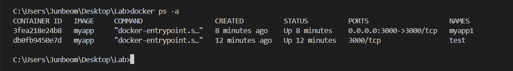

- `docker ps` แสดง Container ที่กำลังทำงานอยู่
- `docker ps -a` หรือ `docker ps --all` แสดง Container ทั้งหมด ทั้งที่ปิดและทำงานอยู่

หรือสามารถดูจาก Docker Desktop ได้ในหน้านี้<br/><br/>


### 10. แก้ไข index.js และทำการ rebuild Docker Image

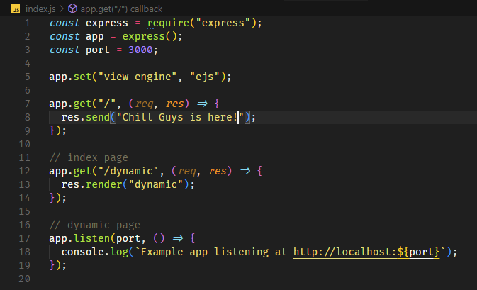

### 11. Stop Container

หยุด Container ที่กำลังทำงานอยู่<br/><br/>
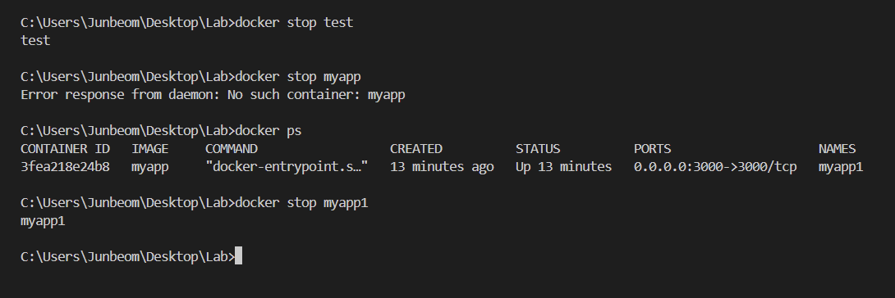

```
docker stop [container-name หรือ container-id]
```

### 12. Remove Container

ลบ Container ที่**หยุด**ทำงานอยู่<br/><br/>
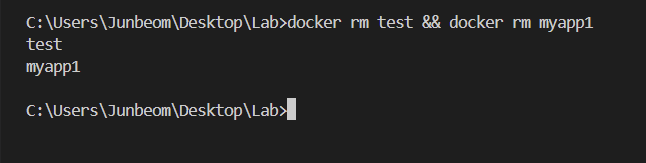

```
docker rm [container-name หรือ container-id]
```

> [!TIP]
> ถ้าไม่ทำการ stop container ก่อนจะไม่สามารถปิดได้

### 13. Run Docker Container ด้วย Image ใหม่

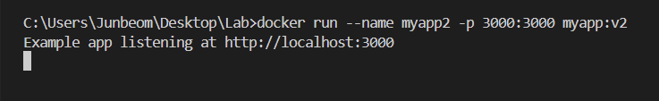
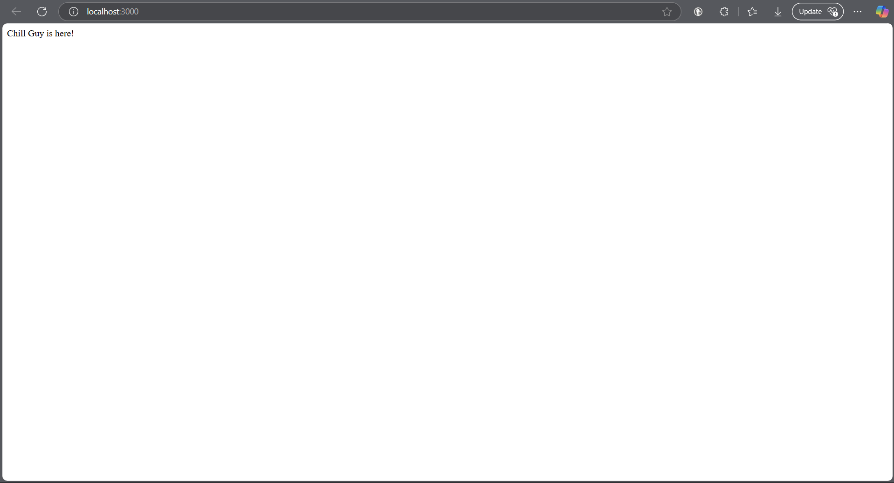

### 14. Mount Volume

คือการเชื่อมต่อ directory หรือ file จากเครื่อง host (หรือ volume อื่น) เข้าไปใน container ทำให้ container เข้าถึงและแก้ไขข้อมูลบน host ได้โดยตรง และข้อมูลยังคงอยู่แม้ container จะถูกลบไปแล้ว ใช้สำหรับ persist data, share code, และ development workflows.

Docker Mount Volume มี 3 ประเภทหลัก:

1. **Volumes (Named Volumes)**: Docker จัดการทั้งหมด, เหมาะเก็บข้อมูลถาวร, แชร์ข้าม containers ง่าย
   ```bash
   docker run --mount type=volume,src=<volume-name>,dst=<mount-path>
   docker run --volume <volume-name>:<mount-path>
   ```
2. **Bind mounts**: เชื่อม directory/file จาก Host ตรงๆ เข้า Container, เหมาะพัฒนา, แต่ portability น้อยกว่า
   ```bash
   docker run --mount type=bind,src=<host-path>,dst=<container-path>
   docker run --volume <host-path>:<container-path>
   ```
3. **tmpfs mounts**: ข้อมูลอยู่ใน RAM ของ Host, ไม่ persist, เร็ว, เหมาะข้อมูล sensitive หรือ cache

#### โดยใน Lab นีี้เราจะใช้ Bind Mount ในการ Mount ดังนี้

```bash
docker run -v ${pwd}:[path-WORKDIR] -v ${pwd}:[path-WORKDIR]/node_modules
```

- `$(pwd)` หรือ `${pwd}` คือคำสั่งที่ใช้ในการแสดงตำแหน่งปัจจุบันของไฟล์ หรือ Working Directory ของเรา
- `[path-WORKDIR]` คือตำแหน่งที่เราต้องการ mount ไปที่ Container ซึงจากที่เรากำหนดไว้ใน Dockerfile ก่อนหน้า จะเป็น `/app`

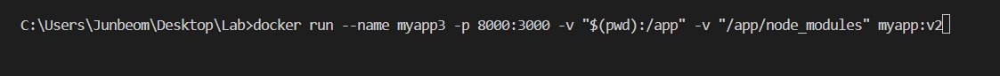


> [!IMPORTANT]
> ต้องใช้ PowerShell เท่านั้น Command Prompt จะไม่สามารถใช้งานไม่ได้ และในบางกรณีคำสั่งที่ใช้ `$(<command สักอย่าง>)` จะใช้ไม่ได้ ให้ลอง `${<command สักอย่าง>}` แทน

### 15. คำสั่งที่ใช้ในการเข้าไปทำงานใน Container (`docker exec`)

สามารถสร้าง shell ใน Continer แบบ Interactive `-it` เพื่อไปแก้ไขหรือทำงานใน Container โดยตรง<br/><br/>
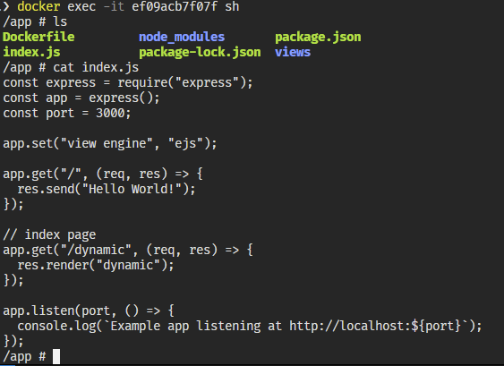
<br/>
เข้าไปทำงานใน Container ด้วย shell `sh`

```bash
docker exec -it [container-name หรือ container id] /bin/sh
```

### 16. ทำการติดตั้ง `nodemon` and เพิ่ม script ไปใน `package.json`

```bash
npm i --save-dev nodemon
```

> [!IMPORTANT]
> อย่าลืม Option `-L` หรือ `--legacy-watch` เพื่อใช้เทคนิค [Chokidar's polling](https://github.com/paulmillr/chokidar) ให้สามารถตรวจจับการเปลี่ยนแปลงใน Mounted Volume ได้

package.json

```json
"dev": "nodemon -L"
```

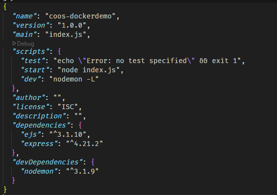

### 17. สร้าง Dockerfile.dev
สร้างไฟล์ชื่อว่า `Dockerfile.dev` ขึ้นมาใน Project<br/>

Dockerfile นี้สำหรับ **dev**, เน้น build image เร็วและ **hot-reloading** <br/>

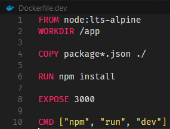

**อธิบาย**

1. **`FROM node:lts-alpine`**: ใช้ Node.js base image alpine lts (เล็ก, เร็ว, เสถียร)
2. **`WORKDIR /app`**: กำหนด `/app` เป็นที่ Working Directory
3. **`COPY package*.json ./`**: **Copy แค่ `package.json` และ lock file** เพื่อติดตั้ง dependencies ก่อน
4. **`RUN npm install`**: ติดตั้ง dependencies
5. **`EXPOSE 3000`**: บอกว่าใช้ port 3000
6. **`CMD ["npm", "run", "dev"]`**: เริ่ม dev server (`npm run dev`, โดยได้กำหนดว่าใช้ `nodemon` ใน `package.json`)


> [!IMPORTANT]
> **ไม่ได้ `COPY . .`** เพราะจะใช้ **Bind Mount** แทน เพื่อ mount โฟลเดอร์ source code จากเครื่อง host เข้า container **ทำให้แก้ไข code แล้ว container เห็นผลทันที (hot-reloading)**


### 18. Build Docker Image ด้วย Dockerfile.dev

โดยขั้นตอนการ Build เหมือนปกติ แต่ในกรณีนี้เราจะระบุ Dockerfile ไฟล์ที่ต้องการใช้ build ด้วย Option `-f` หรือ `--file`<br/><br/>
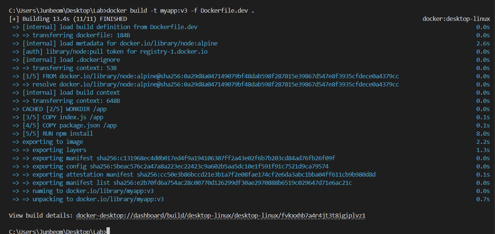

### 19. Stop Container ทั้งหมดและ Delete Container ทั้งหมด

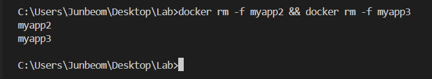

```bash
docker stop $(docker ps -aq)
docker rm $(docker ps -aq)
```

### 20. Run Docker Container ด้วย `myapp:v3`

แล้วลองแก้ไขไฟล์ index.js แล้วสังเกตุการเปลี่ยนแปลงที่ nodemon ใน docker container โดยในข้อนี้ Publish Port 8000 และสร้าง Bind Mount กับ Folder Source Code<br/><br/>
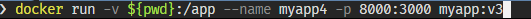

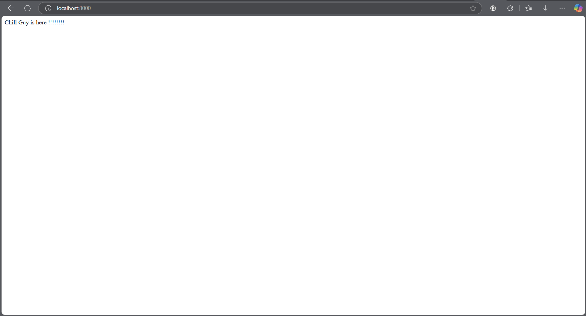

#### หากทำการ Run แล้ว nodemon crash แบบนี้

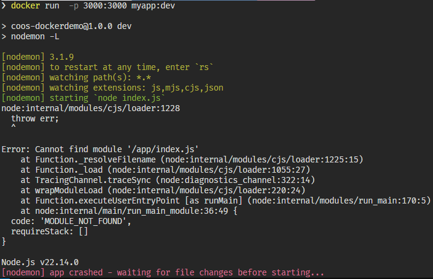<br/>
ให้ตรวจสอบว่าทำการ Mount Volume หรือยัง โดยจากภาพนี้สังเกตุว่ายังไม่ได้ทำการ Mount

## Further Readings

- **Multi-stage Build**<br/>
  คือ การสร้าง image โดยใช้ Dockerfile เดียวแต่แบ่งเป็นหลาย "stage" แต่ละ stage เริ่มต้นจาก FROM image ใหม่ Stage แรกใช้ build app และ stage สุดท้าย copy เฉพาะ artifacts ที่จำเป็น ทำให้ image สุดท้ายเล็กลง, สะอาดขึ้น และปลอดภัยขึ้น เพราะไม่ต้องมี build tools ที่ไม่จำเป็นใน runtime image<br/>**Link**:
  [https://docs.docker.com/build/building/multi-stage/](https://docs.docker.com/build/building/multi-stage/)

  ตัวอย่างที่ใช้จริงใน Production: เว็บ [ctf.it.kmitl.ac.th](https://ctf.it.kmitl.ac.th) ใช้ [Nuxt 3](https://nuxt.com/) (ตัดข้อมูล Sensitive ออก)

  ```dockerfile
  FROM node:22-alpine AS builder

  ENV PNPM_HOME="/pnpm"
  ENV PATH="$PNPM_HOME:$PATH"
  RUN corepack enable

  # Set production environment for build
  ENV NODE_ENV=production

  WORKDIR /app
  COPY package.json pnpm-lock.yaml ./

  # Install ALL dependencies (including devDependencies)
  RUN --mount=type=cache,id=pnpm,target=/pnpm/store pnpm install --frozen-lockfile --prod=false

  COPY . .

  RUN pnpm build

  FROM node:22-alpine

  RUN apk add --no-cache tzdata

  ENV TZ=Asia/Bangkok
  ENV NODE_ENV=production


  COPY --from=builder /app/.output ./.output
  COPY --from=builder /app/node_modules ./node_modules
  COPY --from=builder /app/package.json ./package.json

  EXPOSE 3000
  CMD ["node", "./.output/server/index.mjs"]
  ```
