# Docker Compose Lab #13

# Section 0: Introduction

## Docker Compose คืออะไร?
<p align="center">
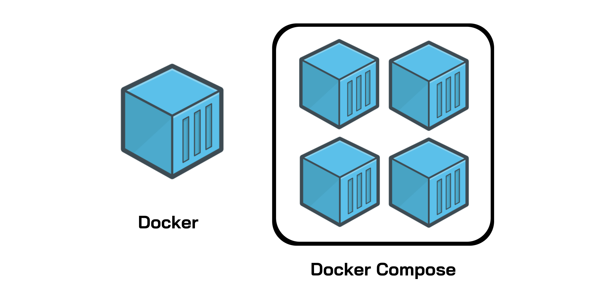
</p>

**Docker Compose** เป็นเครื่องมือที่ช่วยให้การจัดการแอปพลิเคชันแบบมัลติคอนเทนเนอร์เป็นเรื่องง่ายและมีประสิทธิภาพมากขึ้น  แทนที่จะต้องใช้คำสั่ง `docker run` หลายครั้งเพื่อเริ่มต้นแต่ละคอนเทนเนอร์  Docker Compose ช่วยให้เราสามารถกำหนดค่าบริการ (service) ต่างๆ ที่ประกอบกันเป็นแอปพลิเคชันของเราได้ในไฟล์เดียวที่เรียกว่า `docker-compose.yaml`  จากนั้นเราสามารถใช้คำสั่ง `docker compose up` เพียงครั้งเดียวเพื่อเริ่มต้นและรันทุกคอนเทนเนอร์ที่กำหนดไว้พร้อมกันได้

**เปรียบเทียบง่าย ๆ:** ถ้า Docker คือเชฟที่ทำอาหารแต่ละจาน, Docker Compose ก็เหมือนผู้จัดการครัวที่จัดการให้เชฟหลายคนทำอาหารหลายๆ อย่าง (เช่น อาหารเรียกน้ำย่อย, อาหารจานหลัก, ของหวาน) และเสิร์ฟทั้งหมดพร้อมกันได้อย่างลงตัว

**Docker Compose V2:** ปัจจุบัน Docker Compose ได้รวมเข้าไปเป็นส่วนหนึ่งของ Docker CLI แล้ว (V2) ทำให้เราสามารถเรียกใช้งานผ่านคำสั่ง `docker compose` แทนที่ `docker-compose` (V1) ได้เลย  ซึ่ง V2 มีประสิทธิภาพที่ดีกว่าและรองรับฟีเจอร์ใหม่ๆ มากขึ้น

## YAML คืออะไร?

**YAML** (ย่อมาจาก "YAML Ain’t Markup Language") เป็นภาษาสำหรับกำหนดข้อมูลที่เน้นความเรียบง่าย อ่านง่าย และเขียนง่ายสำหรับมนุษย์  YAML เหมาะสำหรับการเขียนไฟล์กำหนดค่าต่างๆ เนื่องจากมีโครงสร้างที่ชัดเจนโดยใช้การเยื้อง (indentation) แทนสัญลักษณ์ที่ซับซ้อนอย่าง JSON หรือ XML

ไฟล์ `docker-compose.yaml` เป็นไฟล์ YAML ที่ใช้กำหนดค่าการทำงานของ Docker Compose  โดยทั่วไปจะมีส่วนประกอบหลัก  ดังนี้:

### `version` (ปัจจุบันไม่ต้องใช้แล้ว)

```yaml
version: '3.8' # หรือเวอร์ชันที่สูงกว่า เช่น '3.9', '3.10', '3.11', '3.12'
```


*   `version` ที่เคยอยู่บนสุดของไฟล์ Compose เอาไว้บอกรุ่นของไฟล์ ตอนนี้**ไม่ต้องใส่แล้ว**
*   Compose จะใช้รูปแบบไฟล์ (schema) ที่ใหม่ที่สุดเสมอในการตรวจสอบไฟล์ Compose
*   ถ้าไฟล์ Compose มีอะไรที่ Compose ไม่รู้จัก (เพราะเป็นของใหม่) Compose จะแค่**เตือน** ไม่ได้ทำให้เกิดปัญหา

Source: [https://docs.docker.com/reference/compose-file/version-and-name/#version-top-level-element-obsolete](https://docs.docker.com/reference/compose-file/version-and-name/#version-top-level-element-obsolete)

#### หมายเหตุ:

- **เลือกเวอร์ชันที่เหมาะสม:**  โดยทั่วไปควรเลือกเวอร์ชันล่าสุดที่ Docker Engine ของคุณรองรับ  เวอร์ชัน '3.8' ขึ้นไปถือเป็นเวอร์ชันที่ค่อนข้างใหม่และรองรับฟีเจอร์ที่ใช้งานได้หลากหลาย  คุณสามารถตรวจสอบเอกสาร Docker Compose เพื่อดูเวอร์ชันล่าสุดและฟีเจอร์ที่รองรับได้เสมอ
- **เวอร์ชัน `version` ไม่ใช่เวอร์ชัน Docker Compose:**  `version` ใน `docker-compose.yaml` หมายถึงเวอร์ชันของ *ไฟล์ฟอร์แมต* ไม่ใช่เวอร์ชันของ Docker Compose เอง  ดังนั้นการเปลี่ยนเวอร์ชันในไฟล์ไม่ได้หมายถึงการเปลี่ยนเวอร์ชัน Docker Compose ที่คุณใช้

### ตัวอย่าง `services` (จำเป็นต้องมี)

```yaml
services:
  web:
    image: nginx:latest # ระบุ image พร้อม tag :latest เพื่อใช้เวอร์ชันล่าสุด
    ports:
      - "80:80"
    volumes:
      - ./html:/usr/share/nginx/html # Mount volume เพื่อ map โฟลเดอร์ ./html ในเครื่อง host ไปยัง /usr/share/nginx/html ใน container
    networks:
      - app-network # กำหนด network ให้ service นี้

  db:
    image: mysql:8.0 # ระบุ image พร้อมเวอร์ชันที่ต้องการ
    environment:
      MYSQL_ROOT_PASSWORD: secret
      MYSQL_DATABASE: myapp_db
    volumes:
      - db-data:/var/lib/mysql # Named volume สำหรับเก็บข้อมูล database
    networks:
      - app-network

volumes: # กำหนด named volume
  db-data:

networks: # กำหนด network
  app-network:
    driver: bridge # กำหนด driver ของ network (bridge เป็นค่า default)
```

#### อธิบาย:

- `services` เป็นส่วนหลักที่ใช้กำหนดแต่ละคอนเทนเนอร์ (เรียกว่า "service") ที่ Docker Compose จะสร้างและจัดการ  แต่ละ service จะแทนหนึ่งคอนเทนเนอร์ที่ทำงานในแอปพลิเคชันของคุณ

#### โครงสร้างย่อย (ตัวอย่าง):

- `web`:  ชื่อ service สำหรับเว็บเซิร์ฟเวอร์
    - `image`: ระบุ Docker image ที่ใช้สร้างคอนเทนเนอร์ (เช่น `nginx:latest` คือ image Nginx เวอร์ชันล่าสุดจาก Docker Hub)  **ควรระบุ tag ของ image เสมอ** แทนที่จะใช้ `:latest` ใน production เพื่อควบคุมเวอร์ชันของ image ที่ใช้
    - `ports`:  กำหนด port mapping เพื่อเชื่อมต่อ port ของเครื่อง host กับ port ของคอนเทนเนอร์ (รูปแบบ "hostPort:containerPort")  `"80:80"` หมายถึง map port 80 ของ host ไปยัง port 80 ของคอนเทนเนอร์
    - `volumes`:  กำหนด volume เพื่อแชร์ข้อมูลระหว่าง host และคอนเทนเนอร์ หรือระหว่างคอนเทนเนอร์ด้วยกัน
        - **Bind mount:**  `./html:/usr/share/nginx/html` (รูปแบบ `hostPath:containerPath`) คือการ mount โฟลเดอร์ `./html` ในเครื่อง host ไปยัง `/usr/share/nginx/html` ในคอนเทนเนอร์  การเปลี่ยนแปลงไฟล์ในโฟลเดอร์ `./html` จะมีผลในคอนเทนเนอร์ทันที
        - **Named volume:** `db-data:/var/lib/mysql` (รูปแบบ `volumeName:containerPath`) คือการ mount named volume ชื่อ `db-data` ไปยัง `/var/lib/mysql` ในคอนเทนเนอร์  Named volume จัดการโดย Docker และมีความยืดหยุ่นมากกว่า bind mount
    - `networks`:  กำหนด network ที่ service นี้จะเข้าร่วม  `app-network` หมายถึง service `web` จะอยู่ใน network ที่ชื่อ `app-network`

- `db`: ชื่อ service สำหรับ database server (MySQL ในตัวอย่างนี้)
    - `environment`:  กำหนด environment variables ให้กับคอนเทนเนอร์  `MYSQL_ROOT_PASSWORD: secret` และ `MYSQL_DATABASE: myapp_db` คือตัวอย่างการตั้งค่า environment variables สำหรับ MySQL
    - โครงสร้างอื่นๆ คล้ายกับ service `web`

### ส่วนเสริมอื่น ๆ (Optional)

- `volumes`:  ส่วนนี้ใช้กำหนด **named volumes** ที่สามารถนำไปใช้ใน service ต่างๆ ได้  Named volumes ช่วยให้การจัดการ volume เป็นระบบและง่ายต่อการนำกลับมาใช้ใหม่
    - `db-data:`  ประกาศ named volume ชื่อ `db-data`  Docker จะจัดการสร้างและดูแล volume นี้

- `networks`:  ส่วนนี้ใช้กำหนด **networks** ที่คอนเทนเนอร์สามารถเชื่อมต่อถึงกันได้
    - `app-network`:  ประกาศ network ชื่อ `app-network`
        - `driver: bridge`: กำหนด driver ของ network เป็น `bridge` (เป็น driver default)  Docker รองรับ network driver หลายประเภท เช่น `bridge`, `host`, `overlay` เป็นต้น

- `depends_on`: (Optional แต่สำคัญ) ใช้ระบุลำดับการเริ่มต้นของ service  เช่น

```yaml
services:
  web:
    # ...
    depends_on:
      - app # web service จะเริ่มหลังจาก app service เริ่มทำงานแล้ว
  app:
    # ...
    depends_on:
      - db # app service จะเริ่มหลังจาก db service เริ่มทำงานแล้ว
  db:
    # ...
```
- `depends_on` ช่วยให้มั่นใจว่า service ที่ต้องพึ่งพากันจะเริ่มต้นในลำดับที่ถูกต้อง  ในตัวอย่างนี้ `db` จะเริ่มก่อน, ตามด้วย `app`, และสุดท้ายคือ `web`

- `build`: (Optional) ใช้ build Docker image จาก Dockerfile โดยตรงใน `docker-compose.yaml`

```yaml
services:
  app:
    build:
      context: ./app # โฟลเดอร์ context สำหรับ build image (เช่น โฟลเดอร์ที่มี Dockerfile)
      dockerfile: Dockerfile.dev # ชื่อ Dockerfile (ถ้าไม่ได้ชื่อ Dockerfile)
    # ...
```
- `build` ช่วยให้คสามารถ build image ของแอปพลิเคชันของคุณได้โดยตรงจาก Docker Compose โดยไม่ต้อง build image แยกต่างหากด้วยคำสั่ง `docker build`

- **อื่น ๆ:** ยังมี options อื่น ๆ อีกมากมายที่สามารถใช้ใน `docker-compose.yaml` เช่น `restart`, `environment_file`, `logging`, `healthcheck`, `deploy` (สำหรับ Docker Swarm)  คุณสามารถศึกษาเพิ่มเติมได้จากเอกสาร Docker Compose อย่างเป็นทางการ

อ่านเพิ่มเติมได้ที่ Docker Compose Reference
[https://docs.docker.com/reference/compose-file/](https://docs.docker.com/reference/compose-file/)


# Section 1: Preparation

ตรวจสอบว่าติดตั้ง Docker ตาม [Lab Week 13](/Week%2013%20-%20Containerization%20with%20Docker/) ให้เรียบร้อยก่อนถึงจะเริ่มทำต่อได้ ถ้าใช้คอมห้อง Lab 304 ควรสามารถใช้งานได้เลย</br></br>
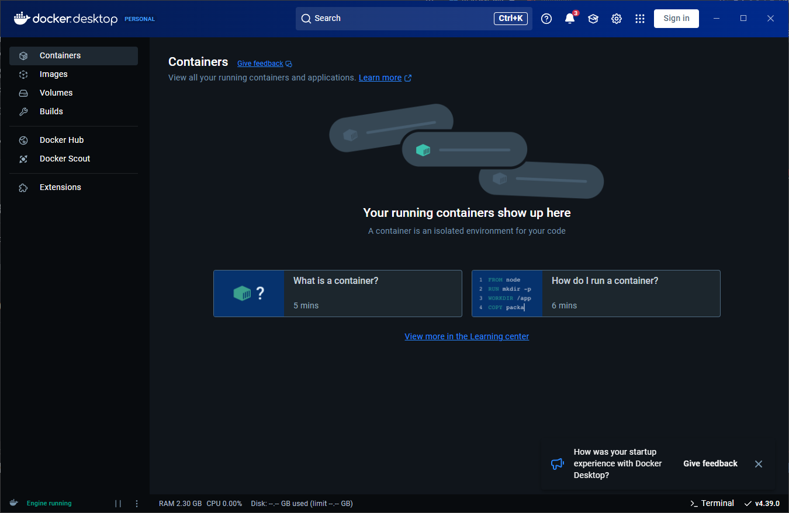

# Section 2: Let's Begin!

### ไฟล์สำหรับทำ Lab วันนี้
ใช้คำสั่ง `git clone` เพื่อดึงไฟล์ที่จะใช้ใน Lab คือ folder `/Week 14 Docker Compose/demo-app` ใน Folder `Week 14 Docker Compose`

```git
git clone https://github.com/Krit789/COOS67-Labs.git
```

### เปิด VS Code ใน Folder `demo-app` จะมีโครงสร้างดังนี้
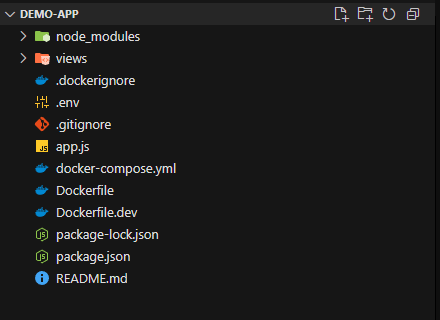

ถ้าถึงจุดนี้แล้ว สามารถเริ่มทำ Lab ได้เลย 🥳

# Section 3: Docker Compose

## 3.1 Introduction
Diagram ของสิ่งที่เราจะทำในวันนี้ เราจะทำการ Deploy Node.js Express Application ที่ทำงานกับ MariaDB และมี Nginx ทำหน้าที่ Reverse Proxy ให้
<p align="center">
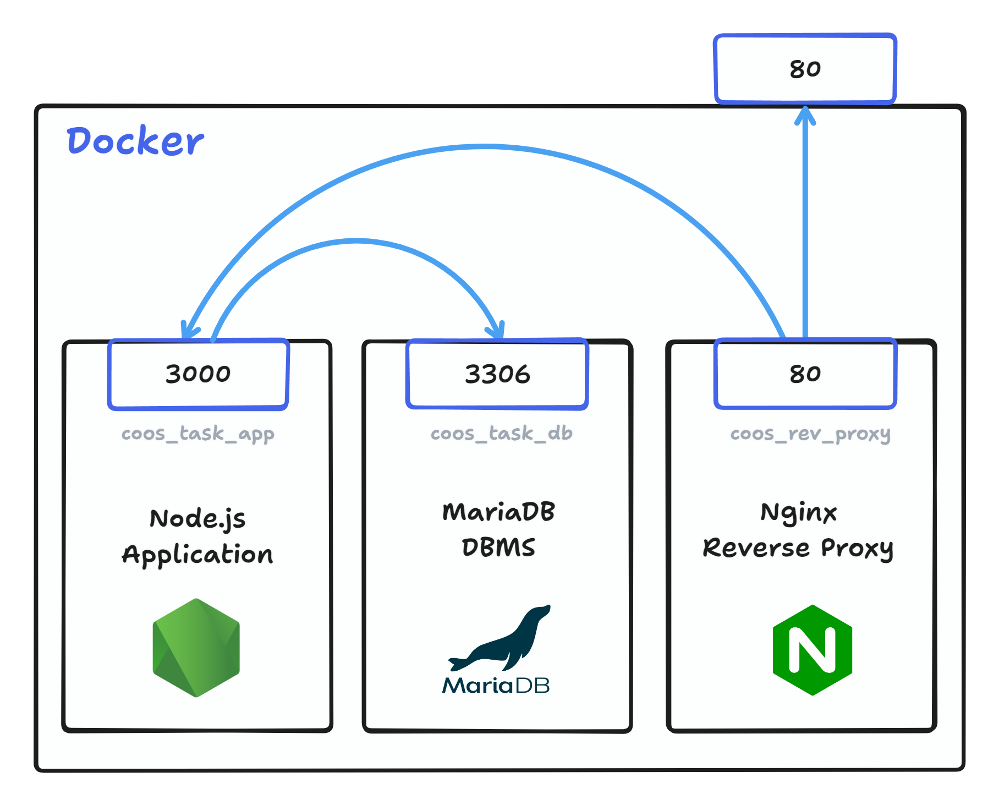
</p>

โดยเราจะสร้าง 3 Container ด้วย Docker Compose ซึ่งประกอบด้วย
- **Node.js Application** (Express.js, EJS) สำหรับรัน Application หลัก
  - 🖧 เปิด Port TCP `3000` ให้ Container อื่น ๆ ใน Docker Network สามารถสื่อสารเข้ามาได้ด้วยคำสั่ง `expose` 
  - 💚 ใช้ `depends_on` ในการรอให้ MariaDB เริ่มการทำงานเสร็จแบบ **Healthy** ก่อนเริ่ม Container นี้
- **MariaDB** Database Management System สำหรับจัดเก็บข้อมูล Task ของผู้ใช้แบบ Persistent
  - 🖧 เปิด Port TCP `3306` ให้ Container อื่น ๆ ใน Docker Network สามารถสื่อสารเข้ามาได้ด้วยคำสั่ง `expose`
  - ⛃ ทำการใช้ Bind Mount Folder `./mariadb:/var/lib/mysql` ในการ Mount Volume จาก Folder ชื่อ `mariadb` เข้ากับ Container MariaDB เพื่อให้คงข้อมูล Database ไว้ตลอด (ไม่ถูกลบตอน down หรือ restart container นั้น ๆ)
  - 🩺 ทำการ `healthcheck` container เพื่อตรวจสอบว่า Database เริ่มใช้งานได้จริง ๆ หรือยัง
      **ตัวอย่าง**
      ```yml
      healthcheck:
        test: ["CMD", "healthcheck.sh", "--connect", "--innodb_initialized"]
        start_period: 10s
        interval: 10s
        timeout: 5s
        retries: 3
      ```

- **Nginx** Webserver สำหรับทำ Reverse Proxy
  - 🌐 เปิด Port TCP `80` ให้เข้าได้ภายนอกด้วยด้วยคำสั่ง `ports`
  - ⛃ ทำการใช้ Bind Mount ไฟล์ Nginx config (`nginx.conf`) `./nginx/nginx.conf:/etc/nginx/nginx.conf:ro` เพื่อให้ nginx ใช้ config จากภายนอก Container ได้แบบ read-only (ไม่ถูกลบตอน down หรือ restart container นั้น ๆ)
  - ❤️ ใช้ `depends_on` ในการรอให้ Node.js Applicaiton เริ่มการทำงานก่อนเริ่ม Container นี้

## 3.2 MariaDB Setup

> [!WARNING]
> * กรุณา Indent ให้ถูกลำดับ โดยคำว่า `db` ควรอยู่ระดับเดียวกับ `app` และต่อ ๆ ไป
> * `["CMD", "healthcheck.sh", "--connect", "--innodb_initialized"]` ต้องเป็นแบบนี้เท่านั้น **ไม่มีเว้นวรรค** ติดกันให้หมด ไม่งั้น Container จะไม่ Healthy

เริ่มต้นจากการ<u>**เพิ่ม**</u> MariaDB ต่อเข้าไปในส่วนที่ Comment ไว้ในไฟล์ `docker-compose.yml` ใน Folder `demo-app` เพื่อสร้าง Container ที่จะรัน Database ของเราขึ้นมา<br/>
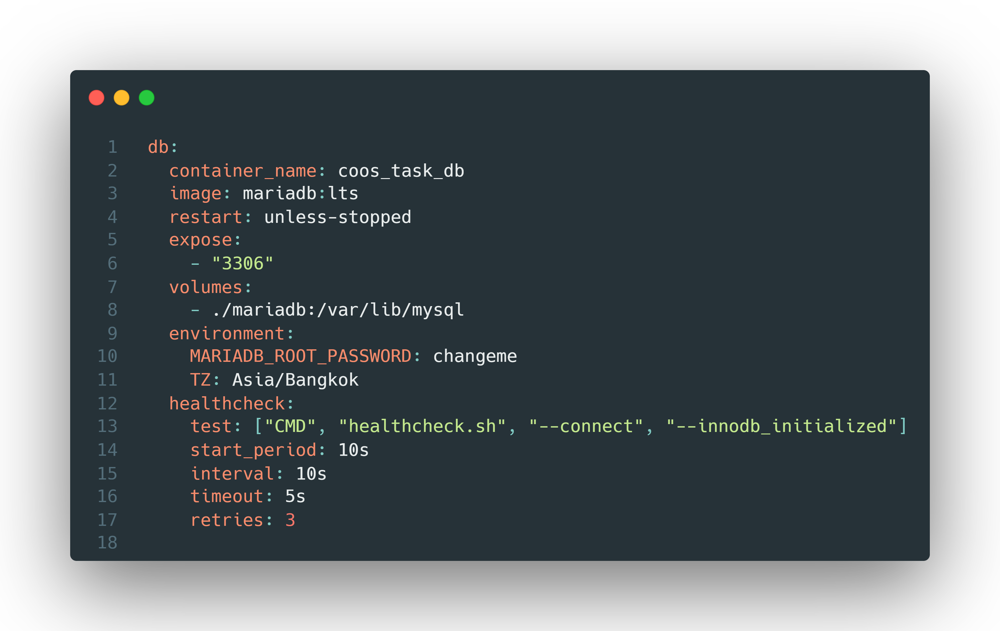

ส่วนนี้จะกำหนดการทำการ Container ของ MariaDB โดยจะแต่ละบรรทัดจะทำงานดังนี้:

*   **`db`**: ชื่อของ service นี้ สามารถตั้งเป็นอะไรก็ได้ แต่ในที่นี้ใส่เป็น db
*   **`container_name: coos_task_db`**:  ตั้งชื่อ container ที่จะถูกสร้างขึ้นว่า `coos_task_db`
*   **`image: mariadb:lts`**: ใช้ image `mariadb` เวอร์ชัน LTS (Long Term Support) ซึ่งจะถูก [pull มาจาก Docker Hub โดยอัตโนมัติ](https://hub.docker.com/_/mariadb)
*   **`restart: unless-stopped`**:  ถ้า container หยุดทำงาน, ให้ restart อัตโนมัติ ยกเว้นว่าจะถูกสั่งหยุดโดยผู้ใช้ (`docker compose down`)
*   **`expose: - "3306"`**: เปิด port 3306 ภายใน container (สำหรับให้ container อื่น ๆ ใน network เดียวกันเชื่อมต่อได้) *ไม่ได้* expose port นี้ไปยัง host machine (เข้าจากข้างนอกไม่ได้)
*   **`volumes: - ./mariadb:/var/lib/mysql`**:  เชื่อมโยง Folder `./mariadb` บนเครื่อง host (เครื่องที่เราสั่ง `docker compose up`) เข้ากับ Folder `/var/lib/mysql` ภายใน container  (ข้อมูลของ MariaDB จะถูกเก็บไว้ที่นี่ ทำให้ข้อมูลไม่หายไปเมื่อ container ถูกลบ)
*   **`environment`**: กำหนด environment variables ภายใน container:
    *   **`MARIADB_ROOT_PASSWORD: changeme`**:  ตั้งรหัสผ่าน root ของ MariaDB เป็น `changeme` (**สำคัญมาก:** ควรเปลี่ยนรหัสผ่านนี้ให้ปลอดภัยกว่านี้ในการใช้งานจริง)
    *   **`TZ: Asia/Bangkok`**:  ตั้ง Timezone เป็น Asia/Bangkok
*  **`healthcheck`**:  กำหนดการตรวจสอบ health check เพื่อให้ Docker รู้ว่า container ทำงานปกติหรือไม่ (healthy หรือไม่):
    * **`test`**: คำสั่งที่ใช้ตรวจสอบ  ใช้สคริปต์ `healthcheck.sh` [ตาม Docs ของ MariaDB](https://mariadb.com/kb/en/using-healthcheck-sh/) เพื่อเช็คว่า MariaDB เชื่อมต่อได้และ InnoDB engine เริ่มทำงานแล้ว
    * **`start_period`**: รอ 10 วินาที หลังจาก container เริ่มทำงาน ก่อนจะเริ่มทำ health check ครั้งแรก
    * **`interval`**: ทำ health check ทุก ๆ 10 วินาที
    * **`timeout`**:  ถ้า health check ใช้เวลานานกว่า 5 วินาที ถือว่าไม่ผ่าน 
    * **`retries`**:  ลองทำ health check ซ้ำ 3 ครั้ง ถ้ายังไม่ผ่าน ถือว่า container ไม่ healthy

**หมายเหตุ**

*   ถ้าต้องการให้ application อื่น ๆ *นอก Docker network* สามารถเข้าถึง database นี้ได้, ต้องใช้ `ports` แทน `expose`  เช่น `ports: - "3306:3306"` (แต่ระวังเรื่องความปลอดภัยด้วย)

## 3.3 Node.js Application Setup

> [!WARNING]
> กรุณา Indent ให้ถูกลำดับ โดยคำว่า `db` ควรอยู่ระดับเดียวกับ `app` และต่อ ๆ ไป

ในส่วนต่อมา<u>**แก้ไข**</u> app service ในไฟล์ `docker-compose.yml` ใน Folder `demo-app` เพื่อที่เราจะทำการตั้งค่า Node.js Applicaion Container โดยเราจะเพิ่มเติม Environment ที่ตั้งจากการทำ MariaDB Container ในส่วนก่อนหน้า เพื่อให้สามารถเชื่อมต่อ Database ได้ และเพิ่มส่วน `depends_on` เพื่อรอให้ Database นั้น Healthy ก่อนเริ่ม Application<br/>
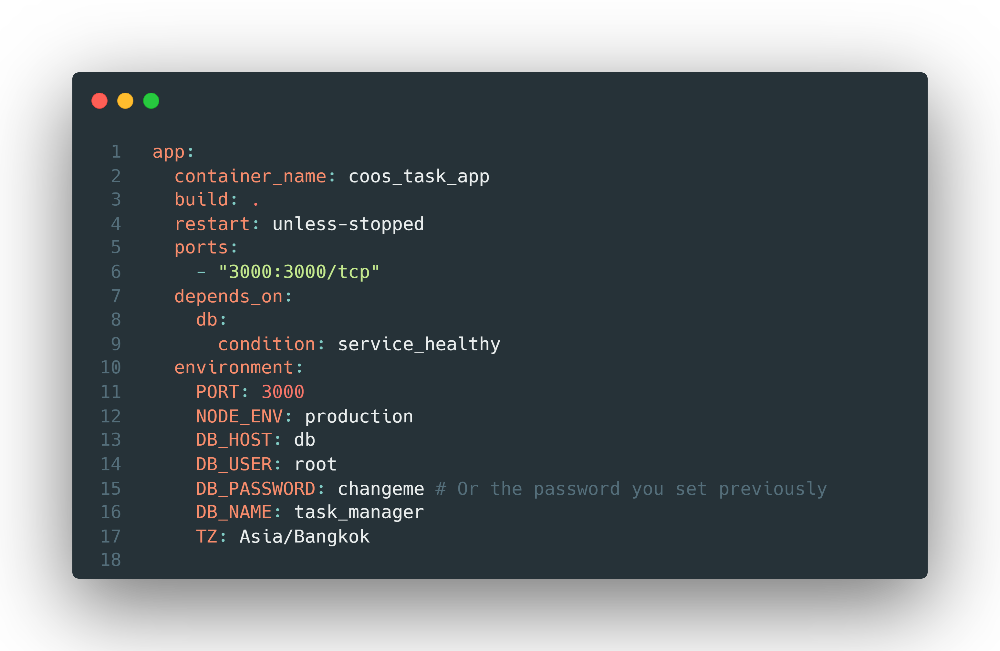
นี่คือส่วนของไฟล์ Docker Compose ที่กำหนดค่าสำหรับ service ของแอปพลิเคชัน (น่าจะเป็น Node.js application):

*   **`container_name: coos_task_app`**: ตั้งชื่อ container ที่จะถูกสร้างว่า `coos_task_app`
*   **`build: .`**:  บอกให้ Docker build image จาก Dockerfile ที่อยู่ใน directory ปัจจุบัน (`.`)  (คือ directory ที่มีไฟล์ `docker-compose.yml` นี้อยู่ ซึ่งก็มีไฟล์ `Dockerfile` อยู่ด้วย)
*   **`restart: unless-stopped`**: เหมือนกับใน service `db`: ถ้า container หยุดทำงาน ให้ restart อัตโนมัติ ยกเว้นว่าจะถูกสั่งหยุดโดยผู้ใช้ (`docker compose down`)
*   **`ports: - "3000:3000/tcp"`**:  เชื่อม port 3000 ของ host machine เข้ากับ port 3000 ของ container  (ทำให้เราเข้าถึง application ได้ผ่าน browser โดยไปที่ [http://localhost:3000](http://localhost:3000) หรือ IP address ของเครื่อง host ที่ port 3000) หรือลองให้เพื่อนเข้าจากดูก็ได้
    * `/tcp` ระบุว่าเป็น protocol TCP
*   **`depends_on`**:  กำหนดว่า service นี้ขึ้นอยู่กับ service อื่น:
    *   **`db`**:  ขึ้นอยู่กับ service ที่ชื่อว่า `db` (ก็คือ MariaDB ส่วนก่อนหน้า)
    *   **`condition: service_healthy`**:  จะเริ่ม service `coos_task_app` *ก็ต่อเมื่อ* service `db` มีสถานะ "healthy" (ผ่าน health heck ที่เรากำหนดไว้ใน service `db`) โดยสามารถตรวจสอบได้จากคำสั่ง `docker ps` ใน Column `STATUS` จะมี `(healthy)` ต่อหลัง Uptime
*   **`environment`**: กำหนด environment variables ภายใน container:
    *   **`PORT: 3000`**:  บอกให้ application รันที่ port 3000 (ซึ่งตรงกับที่เรา expose port ไว้)
    *   **`NODE_ENV: production`**:  บอกว่าเป็น environment production (Node.js application มักจะมีการตั้งค่าที่ต่างกันระหว่าง development กับ production)
    *   **`DB_HOST: db`**:  hostname ของ database คือ `db` (ซึ่งก็คือชื่อ service ของ MariaDB ใน Docker Network ซึ่งจะทำให้ container สามารถคุยกันได้โดยอัตโนมัติ)
    *   **`DB_USER: root`**:  username สำหรับเชื่อมต่อ database คือ `root`
    *   **`DB_PASSWORD: changeme`**:  รหัสผ่านสำหรับเชื่อมต่อ database (<u>**ต้องตรงกับที่ตั้งไว้ใน service `db`**</u>).
    *   **`DB_NAME: task_manager`**:  ชื่อของ database ที่จะใช้
    *   **`TZ: Asia/Bangkok`**:  ตั้ง Timezone เป็น Asia/Bangkok

## 3.4 🚩 Checkpoint #1
ทดลองเปิดใช้งาน Docker Container ที่สร้างขึ้นจาก Docker Compose ถึงตอนนี้ด้วยคำสั่งนี้ **โดยต้องสั่งจากใน Folder `demo-app` เท่านั้น**
```
docker compose up
```
### ✅ ถ้า Console Output ออกมาแบบนี้ แสดงว่าทุกอย่างถูกต้อง
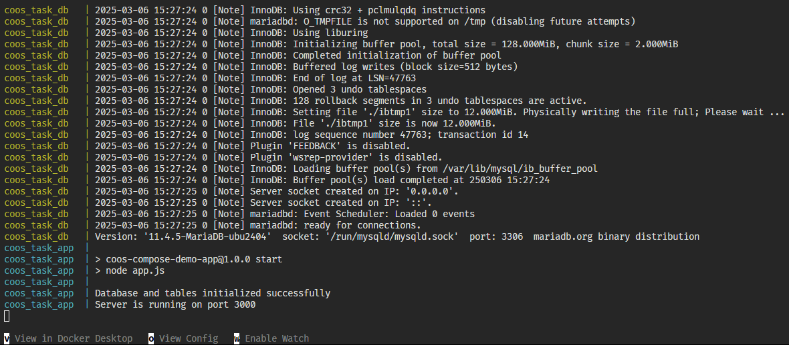

### ✅ ถ้าใช้ Docker Desktop ออกมาแบบนี้ ก็ถูกเช่นกัน
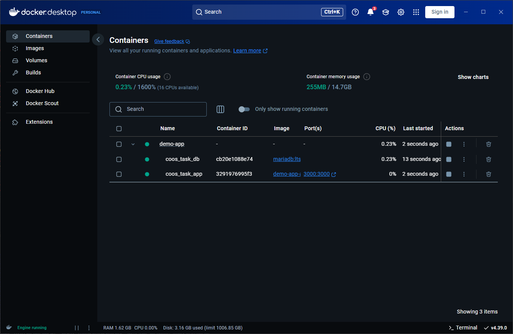</br>
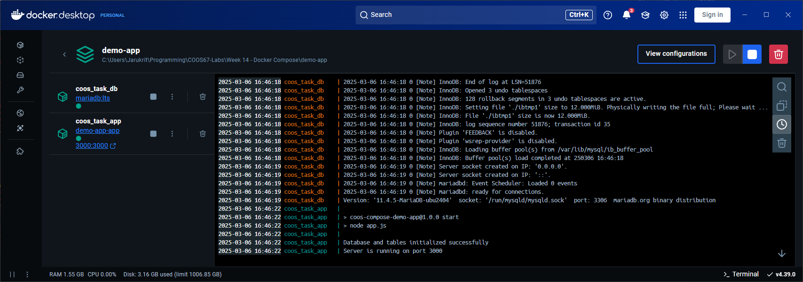

### ❌ กรณี 1 ถ้าเกิด Error แบบนี้ขึ้น (Authentication Failure)
แสดงว่าเชื่อมต่อ Database ไม่สำเร็จเพราะ รหัสผ่านหรือชื่อผู้ใช้ผิด ลองกลับไปตรวจสอบใหม่แล้วลองใหม่ หรือลบ Folder `mariadb` ทิ้งเพื่อล้างรหัสผ่านและข้อมูลทั้งหมดแล้วเริ่มใหม่</br></br>
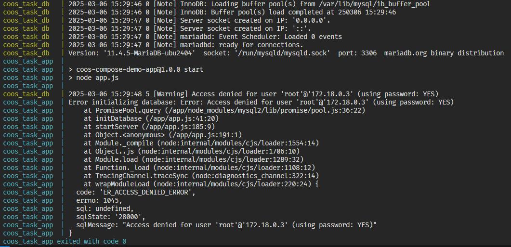

### ❌ กรณี 2 ถ้าเกิด Error แบบนี้ขึ้น (depend_on ไม่ครบ)
ขึ้น Error ถี่ ๆ ก่อน Application จะ Restart เรื่อย ๆ แล้วก็ใช้งานได้เอง ให้ตรวจสอบว่าตั้งค่า `depends_on` ใน app service ถูกต้องไหม</br></br>
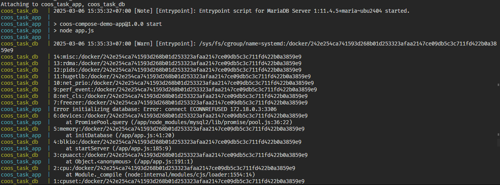

### ผลลัพธ์ที่ควรจะได้
ทดลองเข้า [http://localhost:3000](http://localhost:3000) หรือ IP address ของเครื่อง host ที่ port 3000 แล้วควรจะได้หน้านี้<br/><br/>
ทดลองสร้าง Task ใหม่แล้วดูผลลัพธ์<br/><br/>
<br/><br/>
<br/><br/>
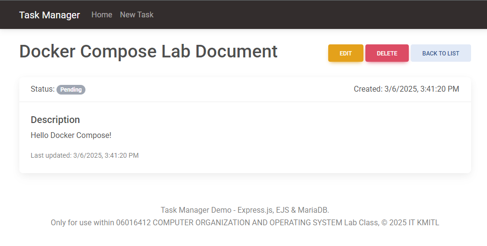<br/>

ถ้าทำการ down container ด้วยการกด `Ctrl + C` หรือใช้คำสั่ง
```
docker compose down
```

แล้วทำการเปิดใหม่ด้วย
```
docker compose up -d
```

แล้วเข้าไปที่เว็บ [http://localhost:3000](http://localhost:3000) หรือ IP address ของเครื่อง host ที่ port 3000
ข้อมูลที่ใส่ไว้ควรจะอยู่ครบ<br/><br/>
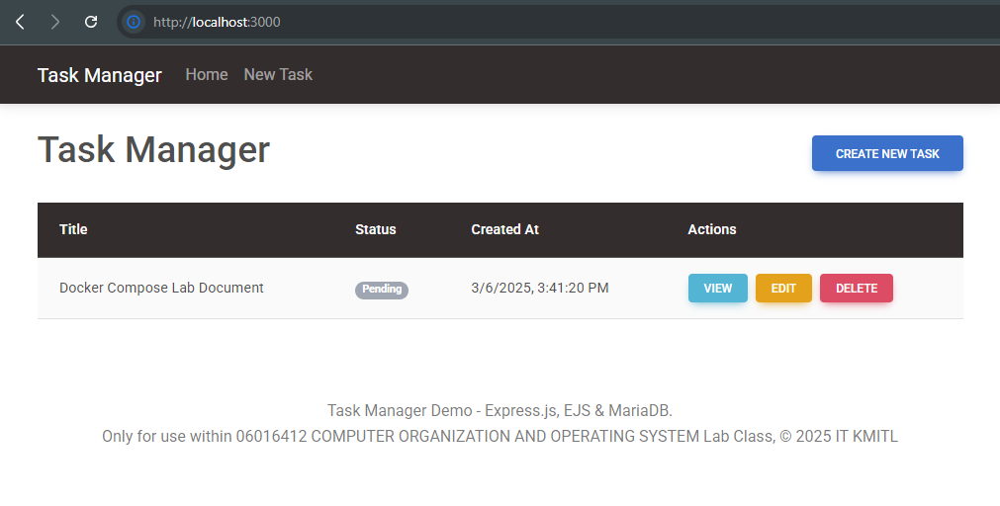<br/>

## 3.5 Nginx กับการ Reverse Proxy
### 🤔 ทำไมต้องทำ Reverse Proxy ด้วย?
*   **HTTPS:** จัดการ SSL/TLS certificates ได้ง่าย, รวมศูนย์, และใช้ [Let's Encrypt](https://letsencrypt.org/) (ใน Lab นี้ไม่ได้ใช้)
*   **Load Balancing:** กระจาย traffic ไปยังหลาย application containers (ถ้ามี ใช้คำสั่ง [`upstream`](https://docs.nginx.com/nginx/admin-guide/load-balancer/http-load-balancer/))
*   **Static Content:** เสิร์ฟไฟล์ static (CSS, JS, รูป) ได้เร็ว, ลดภาระ application server
*   **Security:** ป้องกัน application, กรอง requests, จำกัดการเข้าถึง (เช่นทำ [Basic Authentication](https://docs.nginx.com/nginx/admin-guide/security-controls/configuring-http-basic-authentication/) หรือ ACL)
*   **Caching:** เก็บ content ไว้, ลดภาระ server, เพิ่มความเร็ว
*   **Domains:** จัดการหลาย domains/subdomains ใน server เดียวด้วย Virtual Host
*   **URLs:** Rewrite/Redirect URLs ได้ (เช่น redirect HTTP -> HTTPS)
* **Simplify deployment:** ทำให้การ deploy ง่ายและเป็นระเบียบมากขึ้น

### 3.5.1 แก้ไข app service ในไฟล์ `docker-compose.yml`

ทำการปิด Port 3000 ที่ได้ทำการ Publish ไว้แล้วเปลี่ยนเป็นคำสั่ง `expose` แทน เพื่อให้เข้าได้เฉพาะใน Docker Network เท่านั้น<br/>

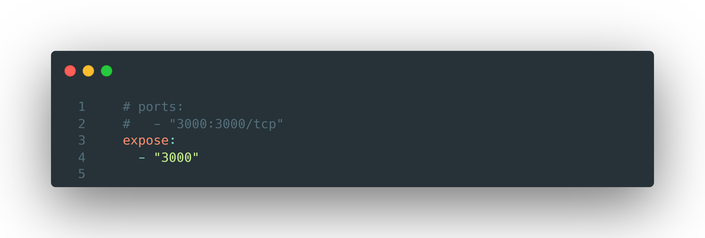

### 3.5.2 เพิ่ม nginx service เข้าไปในไฟล์ `docker-compose.yml`

> [!WARNING]
> กรุณา Indent ให้ถูกลำดับ โดยคำว่า `nginx` ควรอยู่ระดับเดียวกับ `app` และ `db` และต่อ ๆ ไป

<u>**เพิ่ม**</u>ส่วน `nginx` service เข้าไปใน `docker-compose.yml` <u>**ไฟล์เดิม**</u>ใน Folder `demo-app` เพื่อสร้าง Container ที่ให้บริการ Reverse Proxy ขึ้นมา<br/>
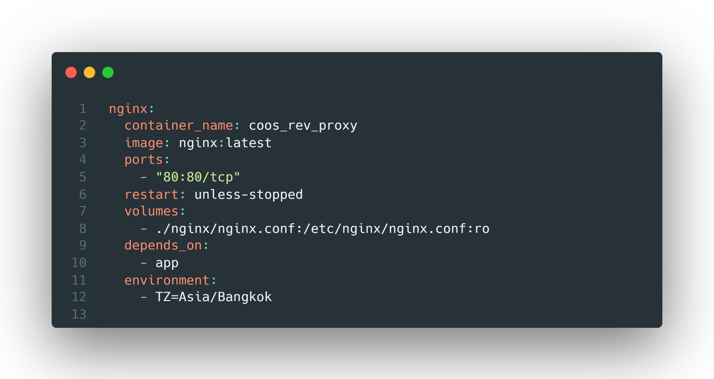
 นี่คือส่วนของไฟล์ Docker Compose ที่กำหนดค่าสำหรับ service Nginx ซึ่งจะทำหน้าที่เป็น Reverse Proxy:

*   **`container_name: coos_rev_proxy`**: ตั้งชื่อ container ที่จะถูกสร้างว่า `coos_rev_proxy`
*   **`nginx`**: ชื่อของ service นี้
*   **`image: nginx:latest`**: ใช้ image [`nginx` เวอร์ชันล่าสุดจาก Docker Hub](https://hub.docker.com/_/nginx)
*   **`ports: - "80:80/tcp"`**: เชื่อม port 80 ของ host machine เข้ากับ port 80 ของ container เพื่อให้บริการ HTTP
*   **`restart: unless-stopped`**:  ถ้า container หยุดทำงาน, ให้ restart อัตโนมัติ ยกเว้นว่าจะถูกสั่งหยุดโดยผู้ใช้
*   **`volumes`**:
    *   **`./nginx/nginx.conf:/etc/nginx/nginx.conf:ro`**:  เชื่อมโยงไฟล์ `nginx.conf` ในโฟลเดอร์ `./nginx` บน host machine เข้ากับไฟล์ `/etc/nginx/nginx.conf` ภายใน container ไฟล์นี้คือไฟล์ configuration หลักของ Nginx
    * `:ro` หมายถึง read-only; container ไม่สามารถแก้ไขไฟล์ configuration นี้ได้ (เป็น best practice ด้าน security)
*   **`depends_on: - app`**:  บอกว่า service `nginx` นี้ขึ้นอยู่กับ service `app` (Container ของ Node.js Application ที่ทำไปก่อนหน้านี้)  Docker Compose จะรอให้เ service `app` เริ่มทำงานก่อน, แล้วค่อยเริ่ม service `nginx`  (ไม่เหมือนกับ `db` ที่ต้องมี `condition: service_healthy` เพราะ Nginx config ส่วนใหญ่จะแค่ forward traffic, ไม่ได้ interact กับ app โดยตรงเหมือน database)
*    **`environment`**:
     *    **`TZ=Asia/Bangkok`**: ตั้ง Timezone เป็น Asia/Bangkok (มีผลตอนเก็บค่าใน Access Logs กับ Error Logs)

### 3.5.3 ตั้งค่า nginx ด้วยไฟล์ `nginx.conf`
สร้าง Folder ใหม่ใน Folder `demo-app` ชื่อว่า `nginx` และสร้างไฟล์ `nginx.conf` ขึ้นมา
```
.
└── demo-app/
    └── nginx/
        └── nginx.conf
```

และเพิ่มการตั้งค่านี้เข้าไปใน `nginx.conf` ซึ่งจะทำการ Reverse Proxy Node.js Application จาก Port 3000 ใน Docker Network ไปสู่ Host Network ที่ Port 80

**nginx.conf**
```nginx
events {
    worker_connections 4000;
    use                epoll;
    multi_accept       on;
}

http {
    include           mime.types;

    sendfile          on;
    tcp_nopush        on;
    keepalive_timeout 65;

    gzip            on;
    gzip_comp_level 6;

    server {
         listen       80;
         server_name  _;
    
         location / {
                proxy_pass       http://app:3000;
                proxy_set_header Host $host;
                proxy_set_header X-Real-IP $remote_addr;
                proxy_set_header X-Forwarded-For $proxy_add_x_forwarded_for;
                proxy_set_header X-Forwarded-Proto $scheme;
         }
     }
}
```

**ส่วน `events`:**

*   **`worker_connections 4000;`**:  กำหนดจำนวน connections สูงสุดที่ worker process แต่ละตัวของ Nginx สามารถจัดการได้พร้อมกัน  ค่านี้ควรปรับให้เหมาะสมกับปริมาณ traffic และ resources ของ server  4000 เป็นค่าเริ่มต้นที่ดี, แต่อาจจะต้องเพิ่มขึ้นถ้า server มี traffic สูงมาก  *ข้อควรระวัง:*  แต่ละ connection จะใช้ file descriptor  ต้องตรวจสอบว่าระบบปฏิบัติการมี limits (เช่น `ulimit -n`) ที่สูงพอ
*   **`use epoll;`**:  บอกให้ Nginx ใช้ `epoll` (บน Linux) สำหรับการจัดการ I/O  `epoll` เป็นกลไกที่มีประสิทธิภาพสูงในการจัดการ network connections จำนวนมาก  (บนระบบปฏิบัติการอื่น, Nginx อาจจะใช้กลไกอื่น เช่น `kqueue` บน FreeBSD)
*   **`multi_accept on;`**:  บอกให้ worker process แต่ละตัวรับ multiple new connections ได้ในคราวเดียว  ช่วยลด latency และเพิ่ม throughput

**ส่วน `http`:**

*   **`include mime.types;`**:  โหลดไฟล์ `mime.types` ซึ่งเป็นไฟล์ที่ mapping file extensions (เช่น `.html`, `.css`, `.js`) เข้ากับ MIME types (เช่น `text/html`, `text/css`, `application/javascript`).  Nginx ใช้ MIME types ในการกำหนด `Content-Type` header ใน HTTP response, ทำให้ browser รู้ว่าจะต้องจัดการกับ response อย่างไร
*   **`sendfile on;`**:  เปิดใช้งาน `sendfile()` system call  `sendfile()` ช่วยให้ Nginx ส่งไฟล์ (โดยเฉพาะ static files) ได้อย่างมีประสิทธิภาพสูง โดยไม่ต้อง copy data ระหว่าง user space กับ kernel space
*   **`tcp_nopush on;`**:  (บน FreeBSD, หรือ `tcp_cork` บน Linux)  เปิดใช้งาน optimization ที่เกี่ยวข้องกับ TCP  เมื่อเปิดใช้งาน, Nginx จะพยายามส่งข้อมูลเป็น "chunks" ที่ใหญ่ขึ้น, ลด overhead ของ TCP headers  (มีประโยชน์เมื่อใช้ `sendfile on`)
*   **`keepalive_timeout 65;`**:  กำหนดระยะเวลา (เป็นวินาที) ที่ Nginx จะ keep HTTP connection ไว้หลังจากที่ไม่มี activity  การใช้ keep-alive connections ช่วยลด overhead ในการสร้าง connection ใหม่สำหรับแต่ละ request  65 วินาทีเป็นค่าเริ่มต้นที่ดี
*   **`gzip on;`**:  เปิดใช้งาน Gzip compression  Nginx จะ compress HTTP responses (เช่น HTML, CSS, JavaScript) ก่อนที่จะส่งไปยัง client, ทำให้ขนาดของ responses เล็กลง, และลดเวลาในการ download
*   **`gzip_comp_level 6;`**:  กำหนดระดับของการ compression  ค่าอยู่ระหว่าง 1 (เร็วสุด, compression น้อยสุด) ถึง 9 (ช้าสุด, compression มากสุด)  6 เป็นค่าที่สมดุลระหว่าง compression ratio กับ CPU usage

**ส่วน `server`:**

*   **`listen 80;`**:  บอกให้ Nginx listen ที่ port 80 (HTTP).
*   **`server_name _;`**:  `_` เป็น wildcard ที่หมายถึง "match any hostname"  เป็นการ config ที่บอกว่า server block นี้จะ handle requests ที่ *ไม่* match กับ server block อื่น ๆ (ที่มี `server_name` ที่เฉพาะเจาะจงกว่า)  ในกรณีนี้, เนื่องจากมี server block เดียว, มันจะ handle requests ทั้งหมด
*   **`location / { ... }`**:  กำหนด configuration สำหรับ requests ที่ match กับ root path (`/`)  (คือทุก requests).
    *   **`proxy_pass http://app:3000;`**:  ทำ Reverse Proxy:  ส่งต่อ requests ไปยัง `http://app:3000` `app` คือชื่อ service ของ application ใน `docker-compose.yml`, และ `3000` คือ port ที่ application รันอยู่
    *   **`proxy_set_header ...`**:  กำหนด HTTP headers ที่จะส่งต่อไปยัง application node.js ส่วน Headers เหล่านี้สำคัญ เพื่อให้ application server รู้ข้อมูลเกี่ยวกับ request ดั้งเดิม:
        *   **`Host $host;`**:  ส่ง `Host` header เดิม (ที่ client ส่งมา) ไปยัง application server
        *   **`X-Real-IP $remote_addr;`**:  ส่ง IP address ของ client ไปยัง application server
        *   **`X-Forwarded-For $proxy_add_x_forwarded_for;`**:  ส่ง IP addresses ที่ request ผ่านมา (รวมถึง IP address ของ proxy servers) ไปยัง application server
        *   **`X-Forwarded-Proto $scheme;`**:  ส่ง protocol (http หรือ https) ที่ client ใช้ ไปยัง application server


### 3.5.4 ทดสอบการใช้งาน

ใช้คำสั่งนี้ เพื่อเริ่มการทำงานของ Container
```
docker compose up -d
```

ถ้าทุกอยากถูกต้อง จะสามารถเข้าหน้าเว็บได้จาก [http://localhost](http://localhost) หรือ IP Address ของเครื่องตัวเองได้โดยไม่ต้องใส่ Port</br></br>
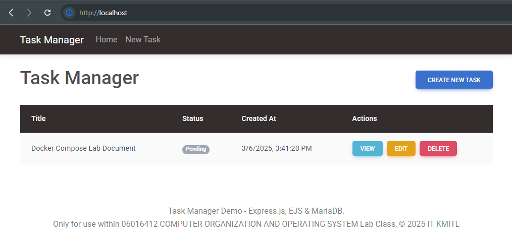

โดยสามารถดูการทำงานได้จาก Docker Desktop หรือ Command Line Interface</br></br>
**Docker Desktop**</br></br>
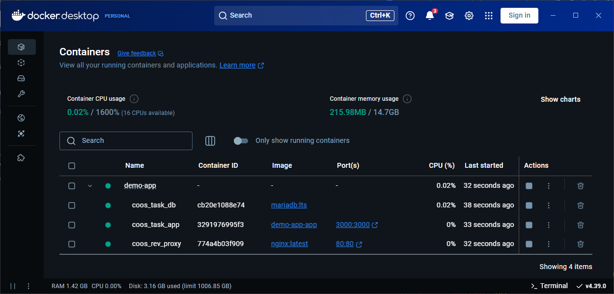</br></br>
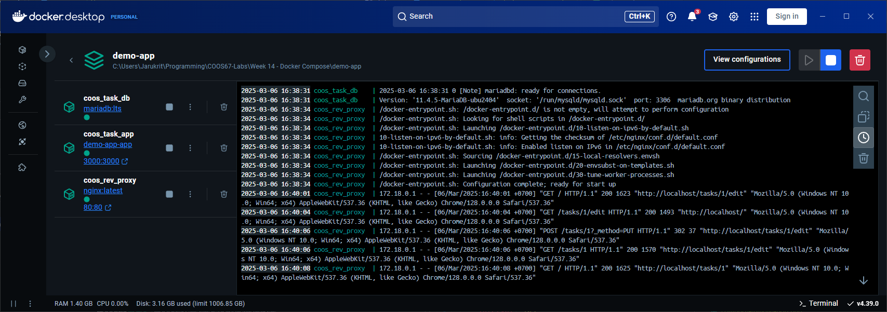</br></br>
**Docker Command Line**</br>
(ถ้าไม่ใส่ `-d` ตอน `docker compose up` หรือใช้คำสั่ง `docker logs -f [container name/id]`)</br></br>
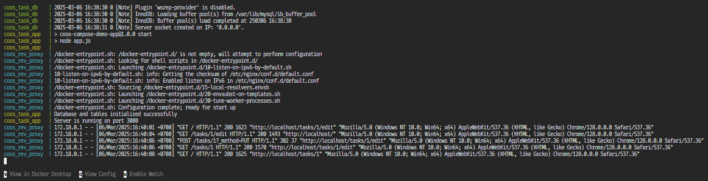
